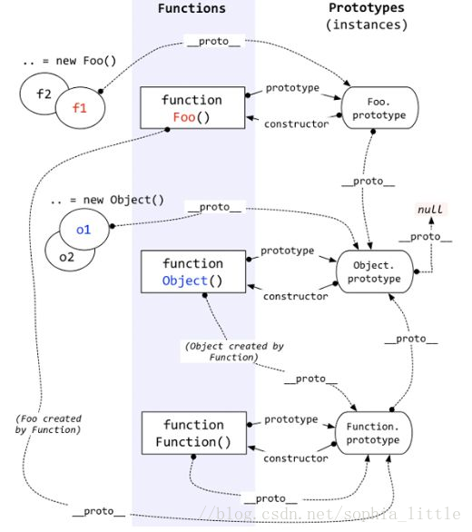
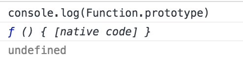

# 原型
> prototype
* [原型](#原型)
* [原型链](#原型链)

### 原型
> 原型是一个对象



* 每个函数都有 prototype 属性，除了 Function.prototype.bind()，该属性指向原型。
* 每个对象都有 ```__proto__``` 属性，指向了**创建该对象的构造函数的原型**。其实这个属性指向了 [[prototype]]，但是 [[prototype]] 是内部属性，我们并不能访问到，所以使用 ```_proto_``` 来访问。
* 对象可以通过 ```__proto__``` 来寻找不属于该对象的属性，```__proto__``` 将对象连接起来组成了原型链。

---

* 实例的 proto 指向该对象的构造函数的原型对象，该对象的构造函数的原型对象中定义了共享的属性和方法
* 构造函数的 prototype 指向原型对象
* 原型对象的 constructor 指回构造函数

1. 方法（Function）是对象，方法的原型也(Function.prototype)是对象。因此，它们都会具有对象共有的特点。

> 即：**对象具有属性 __proto__ 或者说 [[prototype]]，可称为隐式原型，一个对象的隐式原型指向构造该对象的构造函数的原型对象，这也保证了实例能够访问在构造函数原型对象中定义的属性和方法。**

2. 方法这个特殊的对象，除了和其他对象一样有上述 _proto_ 属性之外，还有自己特有的属性——原型属性（prototype），**这个属性是一个指针，指向一个对象，这个对象的用途就是包含所有实例共享的属性和方法（我们把这个对象叫做原型对象）。原型对象也有一个属性，叫做 constructor，这个属性包含了一个指针，指回原构造函数。**

分析上图：  
1. 构造函数 Foo()  

> 构造函数的原型属性 Foo.prototype 指向了原型对象，在原型对象里有共有的方法，所有构造函数声明的实例（这里是f1，f2）都可以共享这个方法。

2. 原型对象 Foo.prototype

> Foo.prototype 保存着实例共享的方法，有一个指针 constructor 指回构造函数。

3. 实例

> f1 和 f2 是 Foo 这个对象的两个实例，这两个对象也有属性 __proto__，指向构造函数的原型对象，这样子就可以像上面1所说的访问原型对象的所有方法啦。

构造函数 Foo() 除了是方法，也是对象啊，它也有 __proto__ 属性，指向谁呢？

指向它的**构造函数的原型对象**呗。函数的构造函数不就是Function嘛，因此这里的__proto__指向了 Function.prototype。

其实除了Foo()，Function(), Object()也是一样的道理。

原型对象也是对象啊，它的 __proto__ 属性，又指向谁呢？

同理，指向它的**构造函数的原型对象**呗。这里是 Object.prototype.

最后，Object.prototype 的__proto__属性指向null。

总结：  
1. 对象有**隐式原型属性** __proto__,指向**该对象的构造函数的原型对象**。
2. 方法除了有属性 __proto__,还有**显示原型属性**prototype，prototype指向该方法的原型对象。

### 显示原型属性prototype
当我们声明一个函数时，这个属性就被自动创建了。
```js
function Foo() {}
```
基本上所有函数都有这个属性，但是也有一个例外
```js
let fun = Function.prototype.bind()
```
这个属性的值是一个对象（也就是原型），该对象只有一个属性 constructor

constructor 对应着构造函数，也就是 Foo。

### 隐式原型属性__proto__
这是每个对象都有的隐式原型属性，指向了创建该对象的构造函数的原型。其实这个属性指向了 [[prototype]]，但是 [[prototype]] 是内部属性，我们并不能访问到，所以使用 _proto_ 来访问。

因为在 JS 中是没有类的概念的，为了实现类似继承的方式，通过 _proto_ 将对象和原型联系起来组成原型链，得以让对象可以访问到不属于自己的属性。

当我们使用 new 操作符时，生成的实例对象拥有了 _proto_属性。
```js
function Foo() {}
// 这个函数是 Function 的实例对象
// function 就是一个语法糖
// 内部调用了 new Function(...)
```
所以可以说，在 new 的过程中，新对象被添加了 _proto_ 并且链接到构造函数的原型上。

new 的过程
1. 新生成了一个对象
2. 链接到原型
3. 绑定 this
4. 返回新对象

在调用 new 的过程中会发生以上四件事情，我们也可以试着来自己实现一个 new
```js
知识点重温：
//this指向调用的对象，当用了call后，能够改变this的指向，也就是指向传进来的对象，这是关键
//shift()函数是将数组的第一个值删除，并返回,这里是得到obj
[].shift.call(arguments)

因为 arguments 构造如下，第一个是长度
{length:2,0:'first',1:'second'};

```
[Array.prototype.slice.call(arguments)](https://www.cnblogs.com/littledu/archive/2012/05/19/2508672.html)
```js
function create() {
  // 创建一个空的对象
  let obj = new Object()
  // 获得构造函数
  let Con = [].shift.call(arguments)
  // 链接到原型
  obj.__proto__ = Con.prototype
  // 绑定 this，执行构造函数
  let result = Con.apply(obj, arguments)
  // 确保 new 出来的是个对象
  return typeof result === 'object' ? result : obj
}
function Person (name, age) {
  this.name = name;
  this.age = age
}
var a = create(Person, '小花', '16')
console.log(a) // Person {name: "小花", age: "16"}
```
对于实例对象来说，都是通过 new 产生的，无论是 function Foo() 还是 let a = { b : 1 } 。

对于创建一个对象来说，更推荐使用字面量的方式创建对象。因为你使用 new Object() 的方式创建对象需要通过作用域链一层层找到 Object，但是你使用字面量的方式就没这个问题。
```js
function Foo() {}
// function 就是个语法糖
// 内部等同于 new Function()
let a = { b: 1 }
// 这个字面量内部也是使用了 new Object()
```

### Function.proto === Function.prototype
接下来我们来看 Function.prototype 这个特殊的对象，如果你在浏览器将这个对象打印出来，会发现这个对象其实是一个函数。



我们知道函数都是通过 new Function() 生成的，难道 Function.prototype 也是通过 new Function() 产生的吗？答案也是否定的，这个函数也是引擎自己创建的。首先引擎创建了 Object.prototype ，然后创建了 Function.prototype ，并且通过 __proto__ 将两者联系了起来。这里也很好的解释了上面的一个问题，为什么 let fun = Function.prototype.bind() 没有 prototype 属性。因为 Function.prototype 是引擎创建出来的对象，引擎认为不需要给这个对象添加 prototype 属性。

所以我们又可以得出一个结论，不是所有函数都是 new Function() 产生的。

**有了 Function.prototype 以后才有了 function Function() ，然后其他的构造函数都是 function Function() 生成的。
**
现在可以来解释 Function.__proto__ === Function.prototype 这个问题了。因为先有的 Function.prototype 以后才有的 function Function() ，所以也就不存在鸡生蛋蛋生鸡的悖论问题了。对于为什么 Function.__proto__ 会等于 Function.prototype ，个人的理解是：其他所有的构造函数都可以通过原型链找到 Function.prototype ，并且 function Function() 本质也是一个函数，为了不产生混乱就将 function Function() 的 __proto__ 联系到了 Function.prototype 上。

## 原型链
当试图得到一个对象的某个属性时，如果这个对象本身没有这个属性，那么会去它的__proto__（即它的构造函数的prototype）中寻找,就是链式结构称为原型链

```js
Object.prototype.__proto__ === null
```

那么如何判断这个属性是不是对象本身的属性呢？使用hasOwnProperty，常用的地方是遍历一个对象的时候。
```js
var item
for (item in f) {
    // 高级浏览器已经在 for in 中屏蔽了来自原型的属性，但是这里建议大家还是加上这个判断，保证程序的健壮性
    if (f.hasOwnProperty(item)) {
        console.log(item)
    }
}
```

### 原型链中的this
所有从原型或更高级原型中得到、执行的方法，其中的this在执行时，就指向了当前这个触发事件执行的对象

### instanceof
instanceof 可以正确的判断对象的类型，因为内部机制是通过判断对象的原型链中是不是能找到类型的 prototype

我们也可以试着实现一下 instanceof
```js
function instanceof(left, right) {
    // 获得类型的原型
    let prototype = right.prototype
    // 获得对象的原型
    left = left.__proto__
    // 判断对象的类型是否等于类型的原型
    while (true) {
    	if (left === null)
    		return false
    	if (prototype === left)
    		return true
    	left = left.__proto__
    }
}
```