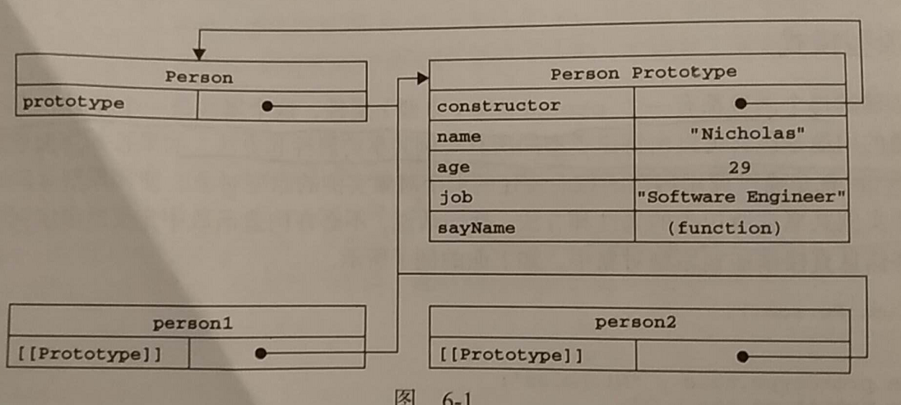
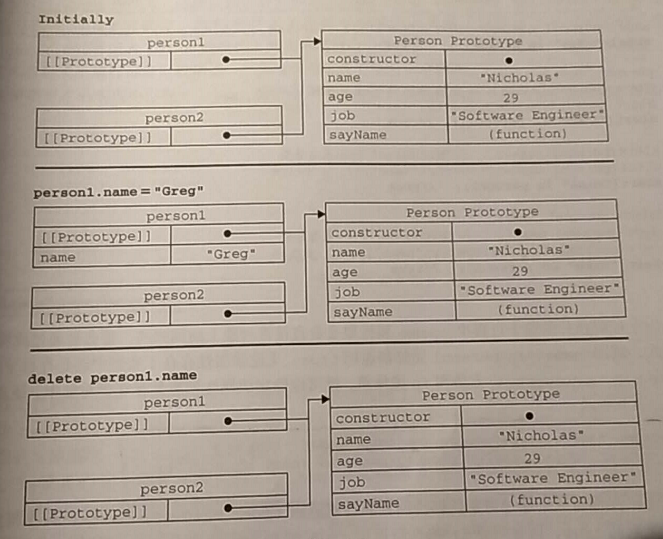
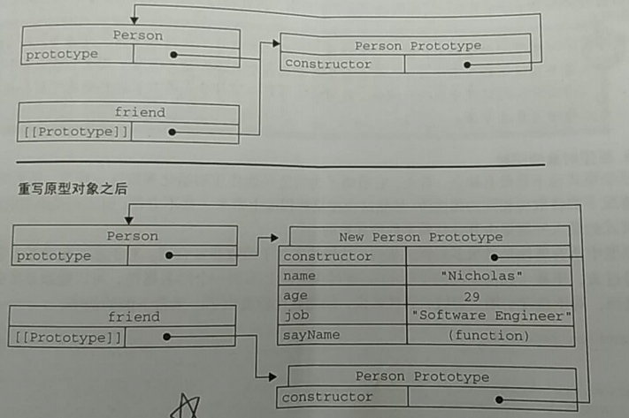

# 对象
> object

* [理解对象](#理解对象)
  * [属性类型](#属性类型)
  * [属性的方法](#属性的方法)
* [创建对象](#创建对象)
  * [工厂模式](#工厂模式)
  * [构造函数模式](#构造函数模式)
  * [原型模式](#原型模式)
  * [组合使用构造函数模式和原型模式](#组合使用构造函数模式和原型模式)
  * [动态原型模式](#动态原型模式)
  * [寄生构造函数模式](#寄生构造函数模式)
  * [稳妥构造函数模式](#稳妥构造函数模式)

## 理解对象
### 属性类型
**1.数据属性**
* [[Configuable]]：是否可配置，true
* [[Enumerable]]：是否可枚举，true
* [[Writable]]：是否可写，true
* [[Value]]：值，undefined

Object.defineProperty()

接收三个参数：属性所在对象、属性的名字、一个描述符对象

**2.访问器属性**
* [[Configuable]]：是否可配置，true
* [[Enumerable]]：是否可枚举，true
* [[Get]]：读取属性时调用的函数，默认undefined
* [[Set]]：写入属性时调用的函数，默认undefined

```js
var book = {
    _year: 2004, //默认用下划线代指私有变量
    edition: 1
};
Object.defineProperty(book, "year", {
    get: function() {
        return this._year;
    },
    set: function(newValue) {
        if (newValue > 2004) {
            this._year = newValue;
            this.edition += newValue - 2004;
        }
    }
});
book.year = 2005;
alert(book.edition); // 2
```

### 属性的方法
* Object.defineProperties()
> 接收两个参数：属性的对象、对象的属性与要修改的对象中添加和修改的属性一一对应

```js
Object.defineProperties(book, {
    _year: {
        writable: true,
        value: 2004
    },
    edition: {
        writable: true,
        value: 1
    }
})
```
* Object.getOwnPropertyDescriptor()
> 接收两个参数：属性所在的对象、要读取其描述符的属性名称 返回：一个对象，拥有访问器属性或者数据属性

## 创建对象
### 工厂模式
```js
function createPerson(name, age, job) {
    var o = new Object();
    o.name = name;
    o.age = age;
    o.job = job;
    o.sayName = function() {
        alert(this.name);
    }
    return o;
}
var cat = createAnimal("cat", 12, 'a');
var dog = createAnimal("dog", 3, 'b');
```
优点：解决了创建多个相似对象的问题
缺点：无法解决对象识别问题（即怎么知道一个对象的类型） 

### 构造函数模式
```js
function Person(name, age, job) {
    this.name = name;
    this.age = age;
    this.job = job;
    this.sayName = function() {
        alert(this.name);
    };
}
var p1 = new Person("sophia", 18, "teacher");
alert(p1.constructor == Person);//true
alert(p1 instanceof Person);//true
alert(p1 instanceof Object);//true
```
new操作符之后的过程

* 创建一个新对象
* 将构造函数的作用域赋值给新对象（this指向这个新对象）
* 执行构造函数中的代码（为这个新对象添加属性）
* 返回新对象

**1. 调用作用域问题**
```js
var p1 = new Person("a", 1, "a");
p1.sayName(); //a

Person("b", 2 "b");
window.sayName(); //b

var o = new Object();
Person.call(o, "c", 3, "c");
o.sayName(); //c
```
2. 缺点 每个方法都要在每个实例上重新创建一遍，对于完成同样任务的方法此举造成资源浪费

### 原型模式
```js
function Person() {

}
Person.prototype.name = "sophia";
Person.prototype.age = 18;
Person.prototype.sayName = function() {
    alert(this.name);
}
var p1 = new Person();
var p2 = new Person();
alert(p1.sayName == p2.sayName); //true
```
优点：让所有对象实例共享原型对象的属性和方法

**1. 理解原型对象**



```js
alert(Person.prototype.isPrototypeOf(p1)); //true
alert(Object.getPrototypeOf(p1) == Person.prototype); //true
```
可以通过对象实例**访问**保存在原型中的值，但不能通过对象实例**重写**原型中的值。

如果在实例中添加一个与原型属性重名的属性，那就会在实例中创建该属性，该属性将会屏蔽原型那个属性

```js
function Person() {

}
Person.prototype.name = "sophia";
var p1 = new Person();

alert(p1.hasOwnProperty("name")); //false
p1.name = "gg";

alert(p1.name); //gg
alert(p1.hasOwnProperty("name")); //true

delete p1.name;
alert(p1.name);//sophia
```

hasOwnPorperty()只在给定属性存在于对象实例中时，才返回true



**2. 原型与in操作符**
* 单独使用：在通过对象能够访问给定属性时返回true
* for-in循环使用：返回所有能通过对象访问的、可枚举的属性（实例和原型中）

```js
//判断是原型中的属性
function hasPrototypeProperty(object,name){
  return !object.hasOwnProperty(name) && (name in object);
}
```
* Object.keys()：取得对象上所有**可枚举**的**实例**属性
> 接收一个对象参数，返回一个包含所有可枚举属性的字符串数组

* Object.getOwnPropertyNames()：得到所有**实例**属性，无论是否可枚举

**3. 更简单的原型语法**
```js
function Person() {

}
Person.prototype = {
    constructor: Person,
    name: "sophia",
    age: 18,
    sayName: function() {
        alert(this.name);
    }
};
```
每创建一个函数就会同时创建它的prototype对象，这个对象 同时自动获得constructor属性。**字面量语法**本质上重写了默认的prototype，constructor指向Object函数（但instanceof还能返回正确的结果，但通过constructor已经无法确定对象的类型了）

所以可以显示指定指向Person函数，但这种重设会导致它的[[Enumerable]]特性被设为true

**4. 原型的动态性**
```js
function Person() {

}
var p1 = new Person();
Person.prototype = {
    constructor: Person,
    name: "sophia",
    age: 18,
    sayName: function() {
        alert(this.name);
    }
};
```
调用构造函数时会为实例添加一个指向最初原型的[[Prototype]]指针， 而重写原型相当于切断了现有原型和之前已存在的对象实例之间的联系。



**5. 原型对象的问题 **

通过在实例上添加一个同名属性，可以隐藏原型中的对应属性。但在**引用类型**上**共享同一个引用**。
```js
function Person() {
}

Person.prototype = {
    constructor: Person,
    friends: ["sophia", "bb"],
};
var p1 = new Person();
var p2 = new Person();
p1.friends.push("cc");
alert(p1.friends); //sophia,bb,cc
alert(p2.friends); //sophia,bb,cc
```
沿着原型链找到，之后push，并不是在实例上添加属性，所以没有屏蔽之说

### 组合使用构造函数模式和原型模式
是ECMAScript中使用最广泛、认同度最高的一种创建自定义类型的方法
```js
function Person(name, age, job) {
    this.name = name;
    this.age = age;
    this.job = job;
    this.friends = ["sophia", "bb"];
}
Person.prototype = {
    constructor: Person,
    sayName: function() {
        alert(this.name);
    }
}
// 或者
Person.prototype.sayName = function(){
  alert(this.name);
}
// 因为字面量写法会重写原型。而显示指定指向Person函数，但这种重设会导致它的[[Enumerable]]特性被设为true，默认情况下，原生的"constructor"属性是不可枚举的
```
详细可看这篇博文：涉及到重设 constructor 和继承

[关于JavaScript继承的那些事](https://www.cnblogs.com/wilber2013/p/4966587.html)

### 动态原型模式
可以通过检查某个应该存在的方法是否有效，来决定是否需要初始化原型 

优点：把所有的信息都封装在了构造函数中
```js
function Person(name, age, job) {
    this.name = name;
    this.age = age;
    this.job = job;
    this.friends = ["sophia", "bb"];
    if (typeof this.sayName != "function") {
        Person.prototype.sayName = function() {
            alert(this.name);
        };
    }
}
```
注意：使用动态原型模式时，不能使用对象字面量重写原型。如果在已经创建了实例的情况下重写原型，那么就会切断现有实例与新原型之间的联系。

[【JavaScript】动态原型模式创建对象 ||为何不能用字面量创建原型对象?](https://www.cnblogs.com/bloghxr/p/4538051.html)

```js
// 字面量写法：在已经创建了实例的情况再用字面量重写原型，那么就会切断现有实例与新原型之间的联系
function Person() { };
var proto = Person.prototype;
var person = new Person;//实例对象在前
Person.prototype =
{
    name: "Jack",
    sayname: function() {
        console.log("Name:" + this.name);
    }
}
// 新原型不在person对象原型链上
console.log(Person.prototype.isPrototypeOf(person)); //false 
// 原先的原型对象在person对象原型链上
console.log(proto.isPrototypeOf(person)); //true 


//  这样做就不是重新声明一个原型对象，而是对原来的原型对象进行扩展。
function Person() { }
var person = new Person();//实例对象在前
Person.prototype.name = 'Jack';
Person.prototype.sayName = function() {
    console.log(this.name);
}
person.sayName();//Jack
```

### 寄生构造函数模式
其基本思想是创建一个函数，该函数的作用仅仅是封装创建对象的代码，然后再返回新创建的对象。假设我们想创建一个具有额外方法的特殊数组，由于不能直接修改Array构造函数，可以使用此模式
```js
function SpecialArray() {
    //创建数组
    var values = new Array();
    //添加值
    values.push.apply(values, arguments);
    //添加方法
    values.toPipedString = function() {
        return this.join("|");
    }
    return values;
}
//测试
var colors = new SpecialArray("red","blue","green");
alert(colors.toPipedString());//red|blue|green
```
缺点：返回对象与构造函数或者构造函数原型属性没有关系，不推荐使用

### 稳妥构造函数模式
所谓稳妥对象，指的是没有公共属性，而且其方法也不引用this的对象。稳妥构造函数遵循与寄生构造函数类似的模式，但有两点不同：一是新创建对象的实例方法不引用this，二是不适用new操作符调用构造函数。
```js
function Person(name, age, job) {
    //创建要返回的对象
	var o = new Object();
	//定义私有变量
	o.name = name;
	o.age = age;
	o.job = job;
	//添加方法
    o.sayName = function() {
        alert(name);
    };
    return o;
}
//测试
var friend = Person("Nick",29,"Teacher");
friend.sayName();  //"Nick"
```
缺点：返回对象与构造函数或者构造函数原型属性没有关系，不推荐使用