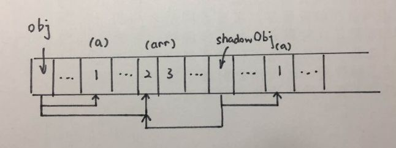

# 拷贝
> copy

## 拷贝
通常，如果给一个变量赋值一个对象，那么两者的值会是同一个引用，其中一方改变，另一方也会相应改变。

首先深复制和浅复制只针对像 Object, Array 这样的复杂对象的。简单来说，浅复制只复制一层对象的属性，而深复制则递归复制了所有层级。

## 浅拷贝
```js
// 使用Object.assign解决
//使用Object.assign()，你就可以不是有继承就能获得另一个对象的所有属性，快捷好用。 
//Object.assign 方法只复制源对象中可枚举的属性和对象自身的属性。
let a = {
    age: 1
}
let b = Object.assign({}, a)
a.age = 2
console.log(b.age) // 1
```
```js
// 使用展开运算符（…）来解决
let a = {
    age: 1
}
let b = {...a}
a.age = 2
console.log(b.age) // 1
```
```js
var obj = { a:1, arr: [2,3] };
var target = {};
var targetObj = mixin(obj,targetObj);
function mixin(sourceObj, targetObj) {
    for (var key in sourceObj) {
        if (!(key in targetObj)) {
            targetObj[key] = sourceObj[key];
        }
    }
    return targetObj;
}
```

因为浅复制只会将对象的各个属性进行依次复制，并不会进行递归复制，而 JavaScript 存储对象都是存地址的，所以浅复制会导致 obj.arr 和 shallowObj.arr 指向同一块内存地址，大概的示意图如下。



## 深拷贝
```js
// 可以通过 JSON.parse(JSON.stringify(object)) 来解决
let a = {
    age: 1,
    jobs: {
        first: 'FE'
    }
}
let b = JSON.parse(JSON.stringify(a))
a.jobs.first = 'native'
console.log(b.jobs.first) // FE
```
但是该方法也是有局限性的：

* 会忽略 undefined
* 不能序列化函数（会忽略函数）
* 不能解决循环引用的对象

并且该函数是内置函数中处理深拷贝性能最快的。当然如果你的数据中含有以上三种情况下，可以使用 lodash 的深拷贝函数。

如果你所需拷贝的对象含有内置类型并且不包含函数，可以使用 MessageChannel
```js
function structuralClone(obj) {
  return new Promise(resolve => {
    const {port1, port2} = new MessageChannel();
    port2.onmessage = ev => resolve(ev.data);
    port1.postMessage(obj);
  });
}

var obj = {a: 1, b: {
    c: b
}}
// 注意该方法是异步的
// 可以处理 undefined 和循环引用对象
const clone = await structuralClone(obj);
```

```js
function deepCopy(target) {
    if (typeof target !== 'object') return;
    var newObj = target instanceof Array ? [] : {};
    for (var item in target) {
        //只复制元素自身的属性，不复制原型链上的
        if (target.hasOwnProperty(item)) {
            newObj[item] = (typeof target[item] == 'Object' ? deepCopy(target[item]) : target[item]);
        }
    }
    return newObj;
}
console.log(deepCopy(test));
```
而深复制则不同，它不仅将原对象的各个属性逐个复制出去，而且将原对象各个属性所包含的对象也依次采用深复制的方法递归复制到新对象上。这就不会存在上面 obj 和 shallowObj 的 arr 属性指向同一个对象的问题。 

