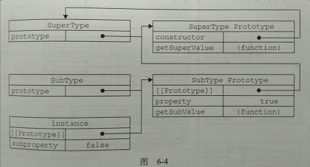
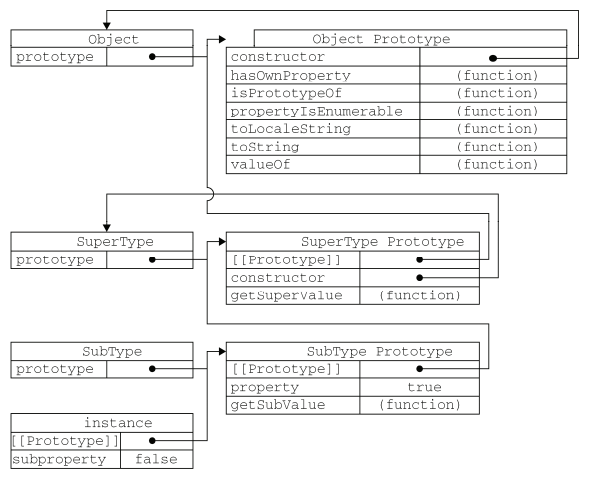
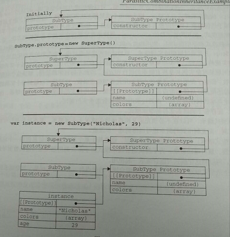
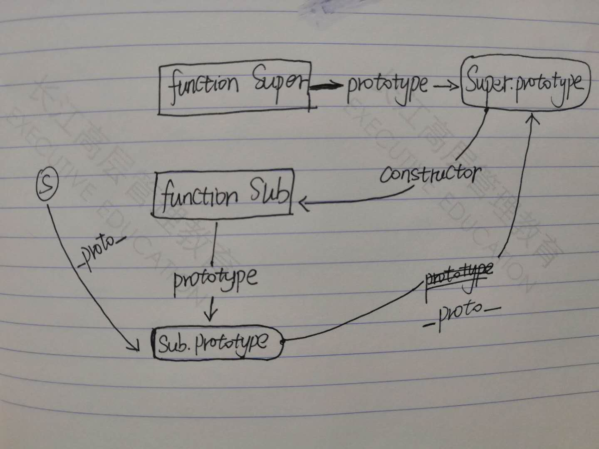

# 继承
> extend

* [继承](#继承)
  * [原型链继承](#原型链继承)
  * [借用构造函数继承](#借用构造函数继承)
  * [组合继承](#组合继承)
  * [原型式继承](#原型式继承)
  * [寄生式继承](#寄生式继承)
  * [寄生组合式继承](#寄生组合式继承)

## 继承
### 原型链继承
利用原型链作为实现继承的主要方法，主要思想是利用原型让一个引用类型继承另一个引用类型的属性和方法
```js
function SuperType() {
this.property = true;
}
SuperType.prototype.getSuperValue = function () {
return this.property;
};
function SubType() {
this.subproperty = false;
}
// 继承SuperType
SubType.prototype = new SuperType();
SubType.prototype.getSubValue = function () {
return this.subproperty;
};
var instance = new SubType();
alert(instance.getSuperValue()); // true
```

SubType继承了SuperType,继承是通过SubType.prototype = new SuperType();实现的。实现的本质是重写原型对象，换成一个新类型(super)的实例。这样，原来存在于SuperType的实例中的属性和方法，也存在与SubType.prototype中了。然后给SubType.prototype添加一个方法，这样就继承了SuperType的属性和方法的基础上又添加了一个方法。



上面没有使用SubType默认提供的原型，而是给它换了一个新原型；这个新原型就是SuperType的实例。新原型内部还有一个指向SuperType的原型的指针。结果变成了instance指向SubType的原型，SubType的原型又指向SuperType的原型。getValue()方法仍然还在SuperType.prototype中，但prototype则位于SubType.prototype中。这是因为property是一个**实例属性**，而getSuperValue()则是一个**原型方法**。既然SubType.prototype现在是SuperType的实例，那么property自然位于该实例中。

注意：**instance.constructor**现在指向的是SuperType，当以读取模式访问一个属性时，首先在实例中搜索。如果没有找到。则会继续搜索实例的原型。通过原型链实现继承的情况下，搜索过程就得以沿着原型链继续向上。

**1. 默认的原型**
Object.prototype



**2. 确定原型和实例的关系**
```js
alert(instance instanceof Object); //true
alert(instance instanceof SuperType); //true
alert(instance instanceof SubType); //true
alert(Object.prototype.isPrototypeOf(instance)); //true
alert(SuperType.prototype.isPrototypeOf(instance)); //true
alert(SubType.prototype.isPrototypeOf(instance)); //true
```

**3. 谨慎地定义方法**
* 给原型添加方法的代码一定要放在替换原型的语句之后

```js
function SuperType() {
  this.property = true;
}
SuperType.prototype.getSuperValue = function () {
  return this.property;
};
function SubType() {
  this.subproperty = false;
}
SuperType.prototype = new SuperType();
// 添加方法
SubType.prototype.getSubValue = function () {
  return this.subproperty;
};
// 覆盖超类中的方法
SubType.prototype.getSuperValue = function () {
  return false;
};
var instance = new SubType();
alert(instance.getSuperValue()); // false
```
* 通过原型链实现继承时，不能使用对象字面量创建原型方法，这样会重写原型链

```js
function SuperType() {
  this.property = true;
}
SuperType.prototype.getSuperValue = function () {
  return this.property;
};
function SubType() {
  this.subproperty = false;
}
// 继承SuperType
SubType.prototype = new SuperType();
// 使用字面量添加新方法，导致上一行代码无效
SubType.prototype = {
  getSubValue :function() {
    return this.subproperty;
  },
  someOtherMethod: function () {
    return false;
  }
};
var instance = new SubType();
alert(instance.getSuperValue()); // error
```
现在的原型包含一个Object的实例，而非SuperType的实例，SubType和SuperType之间已经没有关系了。

**4. 原型链的问题**
> 因此很少单独使用原型链实现继承
* 包含**引用类型**的原型属性会被所有实例共享
```js
function SuperType() {
  this.colors = ["red", "blue", "green"];
}
function SubType() {
}
SubType.prototype = new SuperType();
var instance1 = new SubType();
instance1.colors.push("black");
alert(instance1.colors); // "red", "blue", "green", "black"
var instance2 = new SubType();
alert(instance2.colors); // "red", "blue", "green", "black"

```
SuperType构造函数中定义了一个colors属性，该属性包含一个数组，SuperType的每个实例都会有各自包含自己数组的colors属性。当SubType通过原型链继承了SuperType之后，SubType.prototype就变成了SuperType的一个实例，所以它也拥有了一个它自己的colors属性。但是，SubType的所有实例都会共享这一个colors属性。

* 创建子类型时，不能向超类型的构造函数中传递参数

### 借用构造函数继承
可以在子类构造函数中给超类传递参数

```js
function SuperType(){
    this.colors = ["red", "blue", "green"];
}
function SubType(){
    //继承了SuperType
    SuperType.call(this);
}
var instance1 = new SubType();
instance1.colors.push("black");
alert(instance1.colors); //"red,blue,green,black"
var instance2 = new SubType();
alert(instance2.colors); //"red,blue,green"
 
 
function SuperType(name){
    this.name = name;
}
function SubType(){
    //继承了SuperType，同时还传递了参数
    SuperType.call(this, "Nicholas");
    //实例属性
    this.age = 29;
}
var instance = new SubType();
alert(instance.name); //"Nicholas";
alert(instance.age); //29
```
* 原理：在子类型构造函数的内部调用超类型构造函数
* 优点：解决了superType中的私有属性变公有的问题，可以传递参数
* 缺点：方法在函数中定义，无法得到复用

### 组合继承
将原型链和借用构造函数继承组合



```js
function SuperType(name){
    this.name = name;
    this.colors = ["red", "blue", "green"];
}
SuperType.prototype.sayName = function(){
    alert(this.name);
};
function SubType(name, age){
    SuperType.call(this, name);//借用构造函数继承属性，二次调用
    this.age = age;
}
SubType.prototype = new SuperType();//借用原型链继承方法，一次调用
SubType.prototype.constructor = SubType;
SubType.prototype.sayAge = function(){
    alert(this.age);
};
var instance1 = new SubType("Nicholas", 29);
instance1.colors.push("black");
alert(instance1.colors); //"red,blue,green,black"
instance1.sayName(); //"Nicholas";
instance1.sayAge(); //29
var instance2 = new SubType("Greg", 27);
alert(instance2.colors); //"red,blue,green"
instance2.sayName(); //"Greg";
instance2.sayAge(); //27
```
* 优点：既通过在原型上定义的方法实现了函数复用，又能够保证每个实例都有它的属性。 是JavaScript中最常用的继承模式。
* 缺点：两次调用父构造器函数，浪费内存。

### 原型式继承
对传入的对象进行浅复制
```js
function object(o){
	function F();
	F.prototype = o;
	return new F();
}
```
Object.create()：实现了上面函数的功能

* 缺点：只想让一个对象与另一个对象保持类似的情况下，原型式继承可以胜任， 但包含引用类型值的属性会被共享
* 使用场合：没必要构建构造函数，仅仅是想模拟一个对象的时候

### 寄生式继承
在内部以某种方式增强对象，最后返回对象
```js
function createAnother(original){
    var clone = Object(original); //通过调用函数创建一个新对象
    clone.sayHi = function(){ //以某种方式来增强这个对象
        alert("hi");
    };
    return clone; //返回这个对象
}
var person = {
    name: "Nicholas",
    friends: ["Shelby", "Court", "Van"]
};
var anotherPerson = createAnother(person);
anotherPerson.sayHi(); //"hi"
```
* 缺点：做不到函数复用而降低效率

### 寄生组合式继承
组合继承的缺点:无论在什么情况下，都会调用两次超类构造函数

```js
function inheritPrototype(subType, superType){
    var prototype = object(superType.prototype); //创建对象
    prototype.constructor = subType; //增强对象
    subType.prototype = prototype; //指定对象
}
function SuperType(name){
    this.name = name;
    this.colors = ["red", "blue", "green"];
}
SuperType.prototype.sayName = function(){
    alert(this.name);
};
function SubType(name, age){
    SuperType.call(this, name);
    this.age = age;
}
inheritPrototype(SubType, SuperType);//实现继承
SubType.prototype.sayAge = function(){
    alert(this.age);
};
```
寄生组合继承是引用类型最理想的继承范式·

## ES5中的继承
```js
function Super() {}
Super.prototype.getNumber = function() {
  return 1
}

function Sub() {}
let s = new Sub()
// 创建一个具有指定原型且可选择性地包含指定属性的对象
Sub.prototype = Object.create(Super.prototype, {
  constructor: {
    value: Sub,
    enumerable: false,
    writable: true,
    configurable: true
  }
})
```

以上继承实现思路就是将子类的原型设置为父类的原型

## ES6中的继承
> 语法糖

```
class MyDate extends Date {
  test() {
    return this.getTime()
  }
}
let myDate = new MyDate()
myDate.test()
```
但是 ES6 不是所有浏览器都兼容，所以我们需要使用 Babel 来编译这段代码。

如果你使用编译过得代码调用 myDate.test() 你会惊奇地发现出现了报错

因为在 JS 底层有限制，如果不是由 Date 构造出来的实例的话，是不能调用 Date 里的函数的。所以这也侧面的说明了：ES6 中的 class 继承与 ES5 中的一般继承写法是不同的。

既然底层限制了实例必须由 Date 构造出来，那么我们可以改变下思路实现继承
```
function MyData() {

}
MyData.prototype.test = function () {
  return this.getTime()
}
let d = new Date()
// 设置对象的原型
Object.setPrototypeOf(d, MyData.prototype)
Object.setPrototypeOf(MyData.prototype, Date.prototype)
```
以上继承实现思路：先创建父类实例 => 改变实例原先的 _proto__ 转而连接到子类的 prototype => 子类的 prototype 的 __proto__ 改为父类的 prototype。

通过以上方法实现的继承就可以完美解决 JS 底层的这个限制。