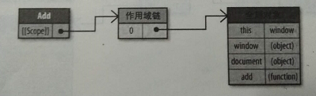
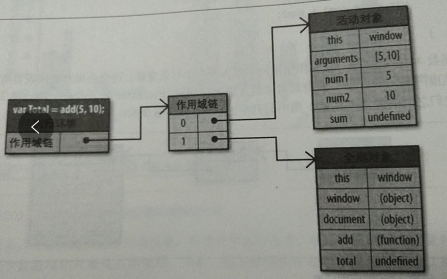
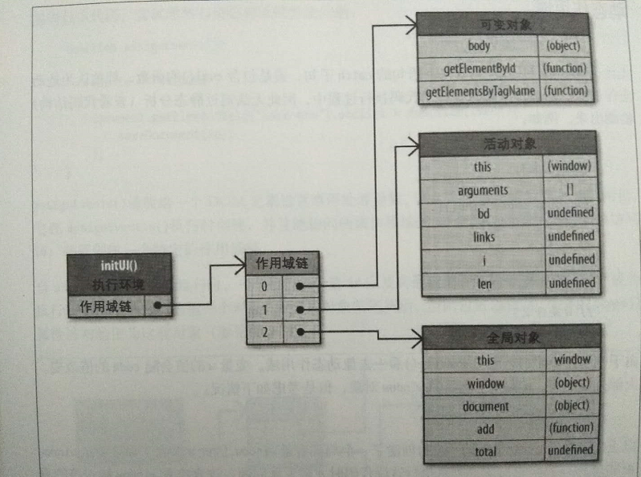
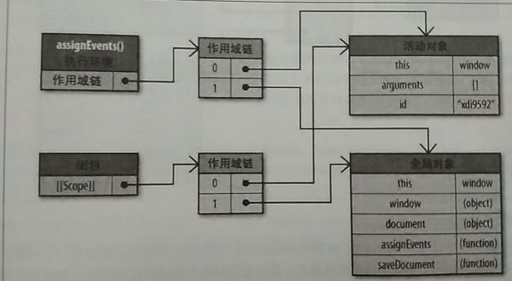
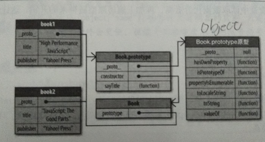
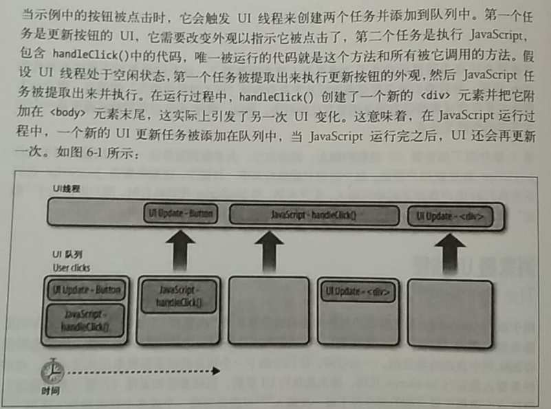
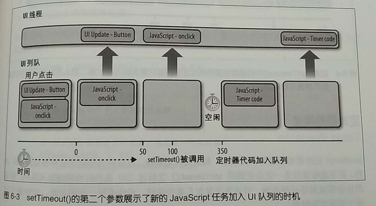

# 《高性能的JavaScript》
> gao

[一、加载和执行](#一加载和执行)
* [脚本位置](#脚本位置)
* [组织脚本](#组织脚本)
* [无阻塞的脚本](#无阻塞的脚本)

[二、数据存取](#二数据存取)
* [管理作用域](#数据存取)
* [对象成员](#对象成员)

[三、DOM编程](#三DOM编程)
* [浏览器中的DOM](#浏览器中的DOM)
* [DOM访问与修改](#DOM访问与修改)
* [重绘与重排](#重绘与重排)
* [事件委托](#事件委托)

[四、算法和流程控制](#四算法和流程控制)
* [循环](#循环)
* [条件语句](#条件语句)
* [递归](#递归)

[五、字符串和正则表达式](#五字符串和正则表达式)
* [字符串连接](#字符串连接)
* [正则表达式优化](#正则表达式优化)
* [去除字符串首位空白](#去除字符串首位空白)

[六、快速响应的用户界面](#六快速响应的用户界面)
* [浏览器UI线程](#)
* [使用定时器让出时间片段](#)
* [WebWorkers](#webworkers)

[七、Ajax](#七Ajax)
* [数据传输](#数据传输)
* [数据格式](#数据传输)
* [Ajax性能指南](#Ajax性能指南)

# 一、加载和执行
> 多数浏览器使用单一进程来处理用户界面和JavaScript脚本执行，所以同一时刻只能做一件事。无论当前的JavaScript代码是内嵌还是包含在外链中，页面的下载和渲染都必须停下来等待脚本执行完成（代码的执行过程会阻塞浏览器的其他进程）。

## 脚本位置
现大多数浏览器允许并行下载JavaScript文件，但由于脚本会阻塞页面其他资源的下载（图片），且页面只有等所有JavaScript代码下载并执行完成才能继续。

所以推荐将脚本放在<body>标签底部
## 组织脚本
考虑到HTTP请求会带来额外的性能开销，因此减少页面中外链的脚本文件数量将会改善性能。

将多个文件合并成一个，文件合并的工作可以通过离线的打包工具实现。
## 无阻塞脚本
> 虽然下载单个较大的JavaScript文件只产生一次HTTP请求，却会锁死浏览器一大段时间。为避免这种情况，需要向页面逐步加载JavaScript文件。秘诀在于：在页面加载完之后才加载JavaScript代码

### 延迟的脚本
正常情况下，当浏览器在解析HTML源文件时如果遇到外部的script，那么解析过程会暂停，并发送请求来下载script文件，只有script完全下载并执行后才会继续执行DOM解析。  
1.async
```
<!-- 指定async,以及 onload 回调-->  
<script async src="siteScript.js" onload="myInit()"></script>  
```
2.defer属性指明本元素所含的脚本不会修改DOM，因此代码能安全地执行。
```
<!-- 指定defer,效果和async差不多-->  
<script defer src="siteScript.js" onload="myInit()"></script>  
```
3.相同点：  
两者都是采用并行下载，在下载过程中不会产生阻塞  

4.两者的区别在于执行时的不同：  

async 脚本在script文件下载完成后会立即执行,并且其执行时间一定在 window的load事件触发之前。这意味着多个async脚本很可能不会按其在页面中的出现次序顺序执行。
  
与此相对，浏览器确保多个 defer 脚本按其在HTML页面中的出现顺序依次执行,且执行时机为DOM解析完成后，document的DOMContentLoaded 事件触发之前。

### 动态脚本元素
无论何时启动下载，文件的下载和执行过程不会阻塞页面的其他进程
```
function loadScript(url,callback){
  var script = document.createElement("script");
  script.type = "text/javascript";
  if(script.readyState){//IE
    script = onreadystatechange = function(){
      if(script.readyState == "loaded" || script.readyScript == "complete"){
        script.onreadystatechange = null;
        callback():
      }
    };
  }else{//其他浏览器
    script.onload = function(){
       callback();
    };
  }
  script.src = url;
  document.getElementByTagName("head")[0].appendChild(script);
}
```
保证加载顺序：
```
loadScript("file1.js",funciton(){
  loadScript("file2.js",funciton(){
     loadScript("file3.js",funciton(){
     });
  });
});
```
但是最好的做法是按顺序合成一个文件，下载一次就能获取所有代码（由于是异步的所有文件大也没关系）

### XMLHttpRequest脚本注入
(其实就是ajax的底层)
```
var xhr = new XMLHttpRequest();
xhr.open("get","file1,js",true);
xhr.onreadystatechange = function(){
  if(xhr.readyState == 4){
    if(xhr.status >=200 && xhr.status < 300 || xhr.status == 304）{
      var script = document.createElement("script");
      script.type = "text/javascript";
      script.text = xhr.respnseText;
      document.body.appendChild(script);
    }
  }
};
xhr.send(null);
```

优点：可以下载JavaScript代码但不立即执行，因为代码是在```<script>```标签之外返回的。

缺点：由于浏览器的同源策略额，因此请求的JavaScript代码与所在页面要处于同一个域，即不能从CDN下载。

### 推荐的无阻塞模式
> 先添加动态加载所需代码，然后加载初始化页面所需的剩下代码。
* YUI3
* LazyLoad
* LABjs

# 数据存取
> 字面量和局部变量的访问速度快于数组项和对象成员的访问速度

## 管理作用域
```
//内部属性[[Scope]]包含了一个函数被创建的作用域中对象的集合
function add(num1,num2){
  var sum = num1 + num2;
  return sum;
}
```


执行函数时会创建一个称为执行环境的内部对象。当函数执行完毕，执行环境就被销毁。



作用域链的搜索过程影响了性能，标识符就是遍历作用域链时最先找到的那个。

### 标识符解析的性能
一个标识符所在的位置越深，它的读写速度也就越慢

如果某个跨作用域的值在函数中被引用一次以上，那么就把它存储到局部变量里。

### 改变作用域链
> 在执行时临时改变作用域链


1.with语句：用来给对象的所有属性创建了一个变量，这个对象被推入作用域链的首位，这意味着函数的所有局部变量处于第二个作用域链对象中，因此访问的代价更高了。

因此，只要存储在局部变量里，就可以提高性能。
```
with(document){...}
```



2.try-catch语句：当try代码块发生错误时，执行过程中会自动跳转到catch子句，然后把异常对象推入一个变量对象并置于作用域的首位。一旦catch子句执行完成，作用域链就会返回到之前的状态。

尽量简化代码使得catch子句对性能的影响最小化。
```
try{
  methodThatMightCauseAnError();
} catch (ex) {
  handleError(ex);//只执行一条语句没有局部变量的访问，作用域链的临时改变就不会影响代码性能
}
```

### 动态作用域
（非必要不推荐使用）
with语句、trycatch语句的catch子句、包含eval（）的函数

### 闭包、作用域和内存
> 闭包：允许函数访问局部作用域以外的数据，可能会导致性能问题。

```
function assignEvent(){
  var id = "123";
  document.getElementById("save-btn").onclick = function(event){
     saveDocument(id);
  }
}
```


函数的活动对象会随着执行环节一同销毁。但引入闭包，由于引用仍然存在于闭包的[[Scope]]属性中，因此激活对象无法被销毁。


id在作用域链的第一个对象之后。因此，将常用的跨作用域变量存储在局部变量中，然后直接访问局部变量。比使用闭包带来的内存和执行速度开销要好。

## 对象成员
> 访问对象成员的速度比访问字面量或变量要慢

### 原型
原型对象为所有对象实例所共享，因此这些实例也共享了原型对象的成员。

对象有两种成员类型：实例成员、原型成员。实例成员直接存于对象实例中，原型成员则从对象继承而来。

```
var book = {
  title:"hi",
  author:"sophia",
}
alert(book.hasOwnProperty("title"));  //true
alert(book.hasOwnProperty("author")); //false
alert("title" in book);  //true
alert("authoe" in book);  //false
```

### 原型链


搜索实例成员比从字面量或局部变量中读取数据代价更高，再加上遍历原型链带来的开销，这让性能问题更加严重。

### 嵌套成员
对象成员可能包含其他成员，eg：window.location.href

对象成员嵌套地越深，读取速度就会越慢。

### 缓存对象成员的值
eg：在同一个函数中没有必要多次读取同一个对象成员

可以把常用的对象成员、数组元素、跨域变量保存在局部变量中来改变JavaScript性能，因为局部变量访问速度更快

## DOM编程
### 浏览器的DOM
文档对象模型（DOM）是一个独立于语言的，用于操作XML和HTML文档的程序接口（API）

### 天生就慢
DOM和JavaScript通过接口彼此连接，就会产生消耗。

## DOM访问与修改
访问DOM的次数越多，代码的运行速度越慢。

法则：减少访问DOM的次数，把运算尽量留在ECMAScript这一端处理

eg:利用局部变量存储修改内容，最后一次写入DOM

### innerHTML对比DOM方法
性能相差无几

### 节点克隆
使用```element.cloneNode()替代document.createElement()```

### HTML集合
HTML集合是包含了DOM节点引用的类数组对象(提供了length属性)。
以下方法返回值就是一个集合:
* document.getElementsByName()
* document.getElementsByClassName()
* document.getElementsByTagName()

以下属性同样返回HTML集合
* document.images
* document.links
* document.forms
* document.forms[0].elements

低效之源：HTML集合一直与文档保持着连接，每次需要最新信息时，都会重复执行查询的过程。

1. 昂贵的集合
```
var divs = document.getElementsByTagName('div');
for(var i=0;i<divs.length;i++){
  document.body.appendChild(document.createElement('div');
}
```
如此遍历HTML集合可能导致逻辑错误，而且也慢  
变快：将HTML集合拷贝到数组  
集合更新导致的逻辑错误：把集合的长度缓存到一个局部变量中

2. 访问集合元素时使用的局部变量
当遍历一个集合时，第一优化原则是把集合存储在局部变量中，并把length缓存在循环外部。用局部变量替代这些需要多次读取的元素。

### 遍历DOM
1. 获取DOM元素
非递归方式：
```
function testNextSiblind(){
  var el = document.getElementById('mydiv'),
      ch = el.firstChild,
      name = '';
  do {
     name = ch.nodeName;
  }while(ch = ch.nextSibling);
  return name;
}
```
```
function testChildNodes(){
  var el = document.getElementById('mydiv'),
      ch = el.childNodes,
      len = ch.length,
      name = '';
  for(var count=0;count<len;count++){
     name = ch[count].nodeName;
  }
  return name;
}
```

2. 元素节点  
```
children               childNodes
childElement           childNodes.length
firstElementChild      firstChild
lastElementChild       lastChild
nextElementSibling     nextSibling
previousElementSibling previousSibling
```
children替代childNodes会更快

3. 选择器API
```
elementList = document.querySelectorAll(selectors);
```
elementList 是一个静态的 NodeList 类型的对象.  
selectors 是一个由逗号连接的包含一个或多个CSS选择器的字符串.  
如果 selectors参数中包含 CSS伪元素,则返回一个空的elementList.  
```
var matches = document.querySelectorAll("div.note, div.alert");
```

## 重绘与重排
浏览器下载完页面所有组件——HTML标记、JavaScript、CSS、图片——之后会解析并生成两个内部数据结构

DOM树：表示页面结构

渲染树：表示DOM节点如何显示

重排（reflow）：当DOM的变化影响了元素的几何属性（宽和高）——比如改变边框宽度或给段落增加文字，导致行数增加——浏览器需要重新计算元素的几何属性，同样其他元素的几何属性和位置也会因此受到影响。浏览器会使渲染树中受到影响的部分失效，并重新构建渲染树。

重绘（repaint）：完成重排后，浏览器会重新绘制受影响的部分到屏幕中。

### 重排何时发生
* 添加或删除可见的DOM元素
* 元素位置改变
* 元素尺寸改变（外边距、内边距、边框厚度、宽度、高度）
* 内容改变
* 页面渲染器初始化
* 浏览器窗口尺寸改变

滚动条出现时触发整个页面的重排

### 渲染树变化的排队与刷新
由于每次重排都会产生计算消耗。大多数浏览器通过队列华修改并批量执行来优化重排过程。而获取布局信息的操作会导致队列刷新
* offsetTop、offsetLeft、offsetWidth、offsetHeight
* scrollTop、scrollLeft、scrollWidth、scrollHeight
* clientTop、clientLeft、clientWidth、clientHeight
* getComoutedStyle() (currentStyle in IE)

## 最小化重绘和重排
> 减少重绘和重排发生次数，应该合并多次对DOM和样式的修改，然后一次处理掉

1. 改变样式
* element.style.cssText = "...";
* 修改CSS的class名称

2. 批量修改DOM  
使元素脱离文档流—>对其应用多重改变—>把元素带回文档中  
上述过程会触发两次重排在步骤一和步骤三，如果忽略这两个步骤，那么第二步骤产生的任何改变都会引起重排  
脱离文档流方法：
```
<ul id = "mylist">
  <li><a href="http://a.com">a</a></li>
  <li><a href="http://b.com">b</a></li>
</ul>
```
```
var data = {
  { 
    name:"c",
    url:"http://c.com"
  },{
    name:"d",
    url:"http://d.com"
  }
};
```
```
function appendDataElement(appendToElement,data){
  var a,li;
  for(var i=0,max=data.length;i<max;i++){
    a = document.createElement('a');
    a.href = data[i].url;
    a.appendChild(document.createTextNode(data[i].name));
    li = document.createElement('li');
    li.appendChild(a);
    appendToElement.appendChild(li);
  }
};
```
* 隐藏元素、应用修改、重新显示
```
var ul = document.getElementById('mylist');
ul.style.display = 'none';
appendDataElement(ul,data);
ul.style.display = 'block';
```
* 使用文档片段在当前DOM之外构建一个子树，再把它拷贝回文档(推荐)
```
var fragment = document.createDocumentFragment();
appendDataElement(fragment,data);
document.getElementById('mylist').appendChild(fragment);
```
* 将原始元素拷贝到一个脱离文档的节点中，修改副本，完成后再替换原始元素
```
var old = document.getElementById('mylist');
var clone = old.cloneNode(true);
appendDataToElement(clone,data);
old.parentNode,replaceChild(clone,old);
```

### 缓存布局信息
浏览器尝试通过队列化修改和批量执行的方式最小化重排次数

最好的做法是：尽量减少布局信息的获取次数，获取后将它赋值给局部变量，然后操作局部变量

```
//沿对角线移动
myElement.style.left = 1+myElement.offsetLeft+'px';
myElement.style.top = 1+myElement.offsetTop+'px';
if(myElement.offsetLeft >=500){
 stopAnimation();
}
```
由于每次移动都会检查偏移量，导致浏览器刷新渲染队列而不利于优化。
```
var current = myElement.offsetLeft;
...
current++;
myElement.style.left = current+'px';
myElement.style.top = current+'px';
if(current>=500){
 stopAnimation();
}
```

### 让元素脱离动画流
针对展开/折叠的方式来显示和隐藏部分页面这种模式，它包括展开区域的几何动画，并将页面其他部分推向下方。

避免页面的大部分重排：
* 使用绝对位置定位页面上的动画元素，将其脱离文档流。
* 让元素动起来，当它扩大时，会临时覆盖部分页面。但这只是页面一个小区域的重绘过程，不会产生重排并重绘页面的大部分内容。
* 当动画结束时恢复定位，从而只会下移一次文档的其他元素

### IE和:hover
当有大量元素使用:hover,会降低响应速度。

## 事件委托
事件绑定占用了处理时间，而且浏览器跟踪每个事件处理器占用了很多内存。使用事件委托可以减少事件处理器的数量。

事件逐层冒泡并能被父级元素捕获

三阶段：捕获、到达目标、冒泡
```
document.getElementById('menu').onclick = function(e){
  e = e || window.event;
  var target = e.target || e.srcElement;

  var pageid,hrefparts;
  
  if(target.nodeName !== 'A'){ return;}

  hrefparts = target.href.split('/');
  pageid = hrefparts[hrefparts.length-1];
  pageid = pageid.replace('.html','');

  //更新页面
  ajaxRequest('xhr.php?page='+id,updatePageContents);
  //浏览器组织默认行为并取消冒泡
  if(typeof e.preventDefault == 'function'){
    e.preventDefault();
    e.stopPropagation();
  else{
    e.returnValue = false;
    e.cancelBubble = true;
  }
};
```

# 四、算法和流程控制
## 循环
### 循环的类型
```
for(var i=0;i<10;i++){
  //
}
```
```
var i=0;
while(i<10){
  i++;
  //
}
```
```
var i=0;
do{
   //
}while(i++ <10)
```
```
for(var prop in object){
  //
}
```

### 循环性能
除非明确需要迭代一个属性数量位置的对象，否则应避免使用for-in循环

1. 减少迭代的工作量
```
//比如最小化属性查找
for(var i=0;len=items.length;i<len;i++){
  process(item[i]);
}
```
```
//比如减少属性查找并反转
var j = items.length;
while(j--){
  process(items[j]);
}
```

2.减少迭代次数
达夫设备（Duff‘s Device):一种循环体展开技术，使得一次迭代实际上执行了多次迭代的操作。
```
var iterations = Math.fllor(items.length/8),
    startAt = items.length%8,
    i = 0;
do{
   switch(startAt){
     case 0:process(item[i++]);
     case 7:process(item[i++]);
     case 6:process(item[i++]);
     case 5:process(item[i++]);
     case 4:process(item[i++]);
     case 3:process(item[i++]);
     case 2:process(item[i++]);
}
startAt = 0;
}while(--iterations);
```
优化后取消了switch语句
```
var i = items.length%8;
while(i){
  process(item[i--]);
}
i = Math.floor(item.length.8);
while(i){
  process(item[i++]);
  process(item[i++]);
  process(item[i++]);
  process(item[i++]);
  process(item[i++]);
  process(item[i++]);
  process(item[i++]);
  process(item[i++]);
}
```
### 基于函数的迭代
```
items.forEach(function(value,index,array){
  process(value);
}
```

## 条件语句
### if-else对比switch
当条件数量较多时，switch比if-else更易读。

### 优化if-else
1. 确保最可能出现的条件放在首位
2. 利用二分法把值域分成一系列的区间，然后逐步缩小范围

### 查找表
比if-else和switch更快
```
var results = [r0,r1,,r2,r3,r4,r5,r6,r7,r8]
return results[value]
```

## 递归
### 调用栈限制
当使用太多递归，甚至会超过最大调用栈容量
### 递归模式
```
//直接递归模式
function recurse(){
  recurse();
}
recurse();
```
```
//隐伏模式
function first(){
  second();
}
function second(){
  first()
}
first();
```
错误原因：
1. 不正确的终止条件
2. 用了太多层递归

### 迭代
任何递归能实现的算法同样可以用迭代来实现。
```
function merge(left,right){
  var result = [];
  while(left.length>0&&right.length>0){
    if(left[0]<right[0]){
       result.push(left.shift());
    else{
       result.push(right.shift());
    }
  }
  return result.concat(left).concat(right);
}
function mergeSort(items){
  if(items.length==1) return items;
  var middle = Math.floor(items/2),
      left = items.slice(0,middle),
      right = items.slice(middle);
  return merge(mergeSort(left),mergeSort(right));
```
```
function mergeSort(items){
  if(items.length==1) return items;
  var work = [];
  for(var i=0;len=items.length;i++){
    work.push([items[i]]);
  }
  work.push([]);
  for(var lim=len;lim>1;lim=(lim+1)/2){
     for(var j=0,k=0;k<lim;j++,k+=2){
        vork[j] = merge(work[k],work[k+1]);
     }
     work[j]=[];
  }
  return work[0];
}
```

### Memoization
避免重复工作，缓存前一个计算结果供后续计算使用
```
//封装
function memoize(fundamental,cache){
  cache = cache || {} ;
  var shell = function(arg){
     if(!cache.hasOwnProperty(arg)){
        cache[arg] = fundamental(arg);
     }
     return cache[arg];
  };
  return shell;
|
```
```
var m = memoize(factorial,{"0":1,"1":1});//阶乘递归函数
var f6 = m(6);
var f5 = m(5);
var f4 = m(4);
```

## 字符串和正则表达式
### 字符串连接
字符串合并方法：
1. The + operator
2. The += operator
3. array.join()
4. string.concat()

### 加(+)和加等(+=)操作符
1. str+="one"+"two"  
在内存中创建临时字符串“onetwo”与str连接
2. str = str + “one” +“two”  
省去了临时字符串的创建，利用拷贝连接

### 数组项合并
Array.prototype.join("")  
因为避免了重复分配内存和拷贝逐渐增大的字符串，性能有了大的提升。

Stirng.prototype.concat()  
比+和+=要慢

## 正则表达式优化
## 去除字符串首位空白

# 快速响应的用户界面
## 浏览器UI线程
> 用于执行JavaScript和更新用户界面的进程通常称为"浏览器UI线程"。  
> UI线程的工作基于一个简单的队列系统，任务会被保存到队列中直到进程空闲。一旦空闲，队列中的下一个任务就被重新提取出来并运行。这些任务要么是运行JavaScript代码，要么是执行UI更新，包括重绘和重排。


### 浏览器限制
1. 调用栈大小限制
2. 长时间运行脚本限制
    * 记录脚本开始以来执行的语句数量
    * 记录脚本执行的总时长
### 多久才算“太久”
限制所有JavaScript任务在100毫秒或更短的时间内完成

## 使用定时器让出时间片段
让出UI线程控制权，使得UI可以更相信。停止JavaScript执行，让UI更新，然后再执行JavaScript。
### 定时器基础
> setTimeout()和setInterval()

告诉JavaScript引擎先等待一段时间，即其他的UI更新和JavaScript任务都会执行。然后添加一个JavaScript任务到UI队列【第二个参数表示任务何时被添加到UI队列】


定时器代码只有在创建它的函数执行完成之后才有可能被执行。如果代码中定时器延迟变小，然后在创建定时器之后又调用另一个函数，那么定时器代码优肯在onclick事件处理完成之前加入队列。这样做的影响是定时器代码在onclick事件处理器执行完成之后立刻运行，甚至觉察不出延迟。

setTimeout()和setInterval()区别：如果UI队列中已经存在由同一个setInterval（）创建的任务，那么后续任务不会被添加到UI队列中。

### 使用定时器处理数组
由于一种造成长时间运行脚本的起因是耗时过长的循环。  

判断是否可以用定时器取代循环的两个因素：1.处理过程无需同步。2.数据无需按顺序处理。
```
//接受三个参数：待处理数组，对每个数组项调用的函数，处理完成后运行的回调函数
function processArray(items,process,callback){
 var todo = items.concat();//克隆原数组

 setTimeout(function(){
  process(todo.shift());
  if(todo.length>0){
    setTimeout(arguments.callee,25);
  }else{
    callback(items);
  }
 },25);
}
```
> 警告：在严格模式下，第5版 ECMAScript (ES5) 禁止使用 arguments.callee()。当一个函数必须调用自身的时候, 避免使用 arguments.callee(), 通过要么给函数表达式一个名字,要么使用一个函数声明.

使用定时器处理数组的副作用是总时长增加，但是为了避免锁定浏览器给用户带来的体验，可以取舍。

### 分割任务
```
//接受三个参数：由待执行函数组成的数组，为每个函数运行时提供参数的数组，处理结束时调用的回调函数
function multistep(steps,args,callback){
  var tasks = steps.concat();
  setTimeout(function(){
    var task = tasks.shift();
    task.apply(null,args || []);
    if(tasks.length>0){
      setTimeout(arguments.calle,25);
    else{
      callback();
    }
  },25);
}
```

### 记录代码运行时间
通过添加一个时间检测机制来改进processArray（）方法使得每个定时器能处理多个数组条目
```
function processArray(items,process,callback){
 var todo = items.concat();//克隆原数组

 setTimeout(function(){
  var start = +new Date();
  do{
     process(todo.shift());
  }while(todo.length>0 && (+new Date() - start <50));
  
  if(todo.length>0){
    setTimeout(arguments.callee,25);
  }else{
    callback(items);
  }
 },25);
}
```

### 定时器与性能
多个重复的定时器同时创建往往会出现性能问题，因为所有的定时器都在争夺唯一一个UI线程的运行时间。

## WebWorkers
> 每个新的Worker都在自己的线程中运行代码，这意味着Worker运行代码不仅不会影响浏览器UI，也不会影响其他Worker中运行的代码。
### Worker运行环境
每个webworker都有自己的全局运行环境，其功能只是JavaScript特性的一个子集。由于webworker没有绑定UI线程，所以它们不能访问浏览器的许多资源。
* 一个navigator对象
* 一个location对象
* 一个self对象，指向全局worker对象
* 一个importScripts()方法
* 所有ECMAScript对象
* XMLHttpRequest构造器
* setTimeout()和setInterval()
* 一个close()方法，它能立刻停止worker运行

```
var worker = new Worker("code.js");
```
要创建网页工人线程，必须传入这个JavaScript文件的URL
此代码一旦执行，将为这个文件创建一个新的线程和一个新的Worker运行环境。该文件会被异步下载，直到文件下载执行完成猴才会启动此Worker

### 与Worker通信
Worker与网页代码通过时间接口进行通信
* postMessage()传递数据
* 用来接收消息的onmessage事件处理器

### 加载外部文件
```
//code.js内部代码
importScript("file1.js","file2.js");
```
importScript的调用过程是阻塞式的，直到所有的文件加载并执行完成之后，脚本才会运行。由于Worker是在UI线程之外运行，所以这种阻塞不会影响到UI响应。

### 实际应用
webworkers适用于处理纯数据，或者与浏览器UI无关的长时间运行脚本。  
eg：解析一个很大的JSON字符串
```
var worker = new Worker("jsonparser.js");
//数据就位时，调用事件处理器
worker.onmessage = function(event){
  var jsonData = event.data;
  evaluateData(jsonData);
};
//传入大量要解析的JSON字符串
worker.postMessage(jsonText);
```
```
//jsonparser.js代码如下
self.onmessage = function(event){
  var jsonText = event.data;
  var jsonData = JSON.parse(jsonText);
  self.postMessage(jsonData);
};
```

其他应用：
* 编码/接码大字符串
* 复杂数学运算（包括图像或视频处理）
* 大数组排序

# 七、Ajax
## 数据传输
### 请求数据
1. XMLHttpRequest(XHR)
> 允许异步发送和接受数据。但不能使用XHR从外域请求数据

```
var url = '/data.php';
var params = [
  'id=934875',
  'limit=20'
];
var req = new XMLHttpRequest();
req.onreadystatechange = function(){
  if(req.readyState == 4){
     var responseHeaders = req.getAllResponseHeaders();
     var data = req.responseText;
     //数据处理
   }
}
req.open('GET',url+?+params.join('&'),true);
req.setRequestHeader('X-Requested-With','XMLHttpRequest');
req.send(null);
```
对于那些不会改变服务器状态，只会获取数据的请求应该使用GET。经GET请求的数据会被缓存起来，如果需要多次请求同一数据的话有助于提升性能。

2. 动态脚本注入
* 该技术可以跨域请求
* 但是不能设置头信息、请求的超时处理或重试
* 传递只能用GET方式
* 响应消息必须是可执行的JavaScript代码
* 是客户端获取并解析数据最快的方法
* JavaScript没有任何权限和访问控制的概念
```
var scriptElement = document.createElement('script');
scriptElement.src = 'http://..../lib.js';
document.getElementByTagName('head')[0].appendChild(scriptElement);

function jsonCallback(jsonStirng){
  var data = eval('('+jsonStirng+')');
  //处理数据
}
```
3. Multipart XHR（MXHR）
> 允许客户端只用一个HTTP请求就可以从服务端向客户端传送多个资源。它通过在服务器端将资源（CSS文件、HTML片段、JavaScript代码或base64编码的图片）打包成一个由双方约定的字符串分割的长字符串发送到客户端。然后用JavaScript代码处理这个长字符串，并根据它的mime-type类型和传入的其他头信息解析出每个资源。

4. iframes
5. Comet

### 发送数据
> 数据只需要发送到服务器
1. XMLHttpRequest
当使用XHR发送数据到服务器时，GET方法更快。因为一个GET请求往服务器只发送一个数据包，而一个POST请求至少发送两个数据包，一个装载头信息，一个装载POST正文。
2. 信标（Beacons）
类似于动态脚本注入。使用JavaScript创建一个新的Image对象，并把src属性设置为服务器上脚本的URL包含了要通过GET传回的键值对数据
```
var url = '/status.php';
var params = [
  'step=2',
  'time=2222'
];
(new Image()).src = url+"?"+params.join("&");
```
服务器会接受到数据并保存下来，无需向客户端返回任何消息。因此性能很小。

缺点：无法发送POST数据，接受到的响应类型是有限的。

### 数据格式 
1. XML:冗长
2. JSON：传输胡尺寸小、解析速度快
3. JSON-P：把数据当成课执行的JavaScript而不是字符串，课跨域
4. HTML：带宽过大
5. 自定义格式

## Ajax性能指南
### 缓存数据
> 最快的ajax请求就是没有请求

* 在服务端，设置HTTP头信息以确保你的响应会被浏览器huanc
* 在客户端，把获取到的信息存储在本地，从而避免再次请求


### 设置HTTP头信息
GET发出请求，响应中设置Expires头信息

### 本地数据存储


