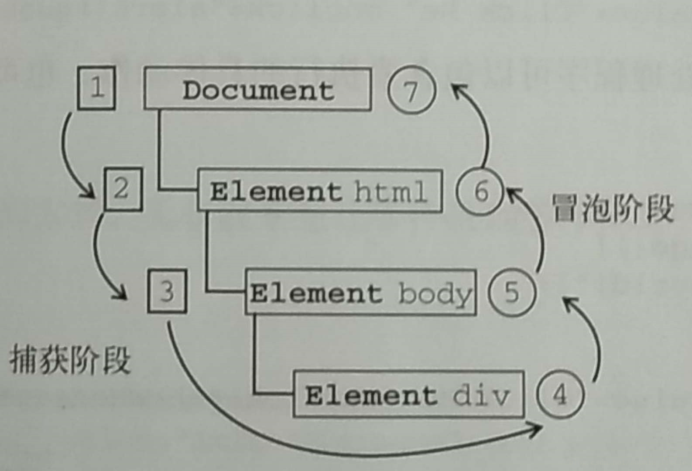

# 事件机制
> event

## 事件、事件流、事件捕获
> 事件流描述的是从页面中接收事件的顺序

1. **事件冒泡**：IE的事件流，即事件开始时由最具体的元素（文档中嵌套层次最深的那个节点）接收，然后逐级向上传播到较为不具体的节点（文档）。
2. **事件捕获**：Netscape提出，思想是不太具体的节点应该更早接收到事件，而具体的节点应该最后接收到事件。
3. **DOM2级事件规定的事件流**：事件捕获阶段、处于目标阶段、事件冒泡阶段



4. **DOM2级事件处理程序**  
用于指定和删除事件处理程序的操作：addEventListener（）和removeEventListener（），都接收三个参数：要处理的事件名、作为事件处理程序的函数和一个布尔值。布尔值为true代表在捕获阶段调用事件处理函数、为false表示在冒泡阶段调用时间处理函数。

如果给一个目标节点同时注册冒泡和捕获事件，事件触发会按照注册的顺序执行。
```
// 以下会先打印冒泡然后是捕获
node.addEventListener('click',(event) =>{
	console.log('冒泡')
},false);
node.addEventListener('click',(event) =>{
	console.log('捕获 ')
},true)
```

## 注册事件
通常我们使用 addEventListener 注册事件，该函数的第三个参数可以是布尔值，**也可以是对象**。对于布尔值 useCapture 参数来说，该参数默认值为 false 。useCapture 决定了注册的事件是捕获事件还是冒泡事件。对于对象参数来说，可以使用以下几个属性

* capture，布尔值，和 useCapture 作用一样
* once，布尔值，值为 true 表示该回调只会调用一次，调用后会移除监听
* passive，布尔值，表示永远不会调用 preventDefault

一般来说，我们只希望事件只触发在目标上，这时候可以使用 stopPropagation 来阻止事件的进一步传播。通常我们认为 stopPropagation 是用来阻止事件冒泡的，其实该函数也可以阻止捕获事件。stopImmediatePropagation 同样也能实现阻止事件，但是还能阻止该事件目标执行别的注册事件。
```
node.addEventListener('click',(event) =>{
	event.stopImmediatePropagation()
	console.log('冒泡')
},false);
// 点击 node 只会执行上面的函数，该函数不会执行
node.addEventListener('click',(event) => {
	console.log('捕获 ')
},true)
```

## 事件代理
如果一个节点中的子节点是动态生成的，那么子节点需要注册事件的话应该注册在父节点上
```
<ul id="ul">
	<li>1</li>
    <li>2</li>
	<li>3</li>
	<li>4</li>
	<li>5</li>
</ul>
<script>
	let ul = document.querySelector('##ul')
	ul.addEventListener('click', (event) => {
		console.log(event.target);
	})
</script>
```
事件代理的方式相对于直接给目标注册事件来说，有以下优点

* 节省内存
* 不需要给子节点注销事件

## 事件委托（事件代理换个说法而已）
事件委托，子元素将监听事件挂在到父元素上，然后当点击子元素的时候，由于事件冒泡，最终会在父元素上触发监听函数，然后执行子元素的回调函数。这样做的好处，就是可以避免在每个子元素上都去挂载监听事件。坏处是有些事件没有冒泡机制，如focus、blur，就无法使用事件委托的方式，还有像一些事件mousemove、mouseout只能通过位置去计算定位，性能消耗太大，不适宜使用事件委托。
```
<!DOCTYPE html>  
<html lang="en">  
    <head>  
        <meta charset="UTF-8">  
        <title>Document</title>  
    </head>  
    <body>  
        <ul id="ul" >  
            <li data-key="北京">北京</li>  
            <li data-key="上海">上海</li>  
            <li data-key="杭州">杭州</li>  
        </ul>  
        <script type="text/javascript">  
            document.getElementById('ul').addEventListener('click',function(e){  
                var value=e.target.attributes['data-key'].value;  
                e.target.style.backgroundColor = 'red';  
                console.log(value);  
        },false);  
        </script>  
    </body>  
</html>  
```