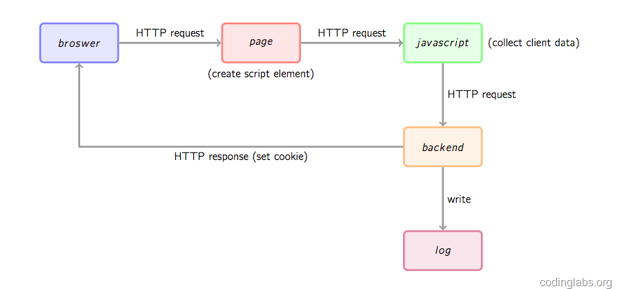
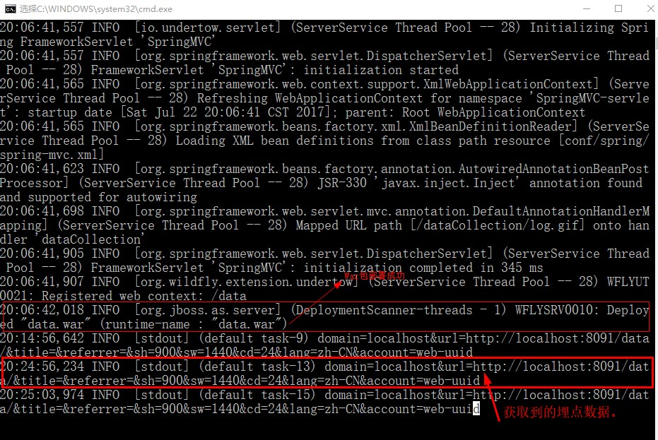

# 埋点与用户行为分析
> mars

## 原理
做用户行为分析的方式有“前端埋点”和“后端埋点”的区分



如上所示，从broswer到page，再到javascript以及后端backend，浏览器返回正常程序运行结果，本地文件中返回最终的log，这很像是在用户程序中埋下了一段“暗代码”，无形之中“窃取”了用户的行为信息，淘宝、网易等都有这样的功能。

## 埋点阶段(create script element)
```js
<script type="text/javascript">
    var _maq = _maq || [];
    // 多维数组
    _maq.push(['_setAccount', 'uuid']);
    (function () {
        var ma = document.createElement('script');
        ma.type = 'text/javascript';
        ma.async = true;
        ma.src = "http://localhost:8091/data/js/ma.js";
        var s = document.getElementsByTagName('script')[0];
        s.parentNode.insertBefore(ma, s);
    })();
</script>
```
这里是正常的jsp、html页面，在页面的下端，往往插入一小段js代码，即我们的“埋点”，如上所示，“埋点”中的全局数组，用于收集该页面中需要被回传的**用户行为**，比如：域名、ip、url、搜索的内容、常按的按钮名称……

之后匿名的js函数，是埋点代码的重中之重，如上代码所示，在Dom节点添加名为‘script’的元素，设置"ma.async = true"，表示让其异步执行，并将其src属性指定为一个单独的js文件（将ma.js引入进来），最终将该element插到当前Dom树上。而这个过程最终的目的即**请求并执行上述的ma.js文件**。
## 数据收集阶段(collect client data)
```js
(function () {
    
    var params = {};
    //Document对象数据
    if (document) {
        params.domain = document.domain || ''; //获取域名
        params.url = document.URL || '';       //当前Url地址
        params.title = document.title || '';
        params.referrer = document.referrer || '';  //上一跳路径
    }
    //Window对象数据
    if (window && window.screen) {
        params.sh = window.screen.height || 0;    //获取显示屏信息
        params.sw = window.screen.width || 0;
        params.cd = window.screen.colorDepth || 0;
    }
    //navigator对象数据
    if (navigator) {
        params.lang = navigator.language || '';    //获取所用语言种类
    }
    //解析_maq配置
    if (_maq) {
        for (var i in _maq) {                      //获取埋点阶段，传递过来的用户行为
            switch (_maq[i][0]) {
                case '_setAccount':
                    params.account = _maq[i][1];
                    break;
                default:
                    break;
            }
        }
    }
    //拼接参数串
    var args = '';
    for (var i in params) {
        // alert(i);
        if (args != '') {
            args += '&';
        }
        args += i + '=' + params[i];           //将所有获取到的信息进行拼接
    }
    //通过伪装成Image对象，请求后端脚本
    var img = new Image(1, 1);
    var src = 'http://localhost:8091/data/dataCollection/log.gif?args=' + encodeURIComponent(args);
    alert("请求到的后端脚本为" + src);
    // 新图像元素只要设置了src属性就会开始下载
    // 所以我们这里的事件一定要在指定src属性之前绑定
    // 这也是为什么我们这里不需要把img标签插入DOM 的原因
    img.src = src;
})();

```
* 解析、获取用户各种信息，如上：1.通过dom树，获取到的url，域名，上一跳信息；2.通过windows，获取到的显视屏的分辨率、长宽（前两类通过内置的js对象获取）；3.通过_maq全局数组，获取埋点时埋下的用户行为数据。
* 将上步的用户信息按特定格式拼接，装到args这个参数中。
* 伪装成图片，请求到后端controller中，并将args作为http request参数传入，做后端分析。

之所以使用图片请求后端controller而不是ajax直接访问，原因在于ajax不能跨域请求，ma.js和后端分析的代码可能不在相同的域内，ajax做不到，而将image对象的src属性指向后端脚本并携带参数，就轻松实现了跨域请求。

## 后端处理阶段(backend和log)
```java
@Controller
@RequestMapping("/dataCollection")
public class DataCollection {
    @RequestMapping(value = "log.gif")
    public void analysis(String args, HttpServletResponse response) throws IOException {
        System.out.println(args);
         
		//日志收集 
		 
        response.setHeader("Pragma", "No-cache");
        response.setHeader("Cache-Control", "no-cache");
        response.setDateHeader("Expires", 0);
        response.setContentType("image/gif");
        OutputStream out = response.getOutputStream();
        BufferedImage image = new BufferedImage(1, 1, BufferedImage.TYPE_INT_RGB);
        ImageIO.write(image, "gif", out);
        out.flush();
    }
}
```
如上所示， 通过解析http request中的参数，即将在前端获取到的用户信息拿到了后端，这个为了验证，将其打印到控制台，接下来就是做日志收集工作了，到此前端获取用户信息已经完成。之后，生成一副1×1的空gif图片作为响应内容并将响应头的Content-type设为image/gif，返回到前端代码中。


如图，是在控制台我拿到的用户信息：



至此，前端埋点的实现以及原理就ok了，包括Google Analytics也是这么个原理来做的。目前程序已经收集到了用户的行为信息，但是存在一个问题就是用户删除cookie信息，比如清楚浏览器缓存，会造成收集到的数据比实际访问的行为数据要多得多，这个问题接下来会继续深入研究。