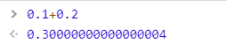
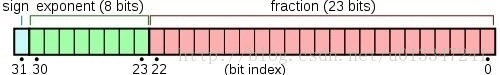
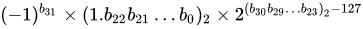
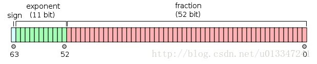

# 0.1加0.2不等于0.3
> 123

## 问题


根本原因：计算机内部的信息都是由**二进制方式**表示的，即0和1组成的各种编码，但由于**某些浮点数没办法用二进制准确的表示出来**，也就带来了一系列精度问题。

## 分析
### 浮点数的二进制表示
1. 整数部分：除2取余数，若商不为0则继续对它除2，当商为0时则将所有余数逆序排列；
2. 小数部分：乘2取整数部分，若小数不为0则继续乘2，直至小数部分为0将取出的整数位正序排列。（若小数部分无法为零，根据有效位数要求取得相应数值，位数后一位0舍1入进行取舍）

利用上述方法，我们尝试一下将0.1转成二进制：
0.1 * 2 = 0.2 - - - - - - - - - - 取0  
0.2 * 2 = 0.4 - - - - - - - - - - 取0  
0.4 * 2 = 0.8 - - - - - - - - - - 取0  
0.8 * 2 = 1.6 - - - - - - - - - - 取1  
0.6 * 2 = 1.2 - - - - - - - - - - 取1  
0.2 * 2 = 0.4 - - - - - - - - - - 取0  
...  

利用上述方法，我们尝试一下将0.2转成二进制：
0.2 * 2 = 0.4 - - - - - - - - - - 取0  
0.4 * 2 = 0.8 - - - - - - - - - - 取0  
0.8 * 2 = 1.6 - - - - - - - - - - 取1  
0.6 * 2 = 1.2 - - - - - - - - - - 取1  
0.2 * 2 = 0.4 - - - - - - - - - - 取0  
0.4 * 2 = 0.8 - - - - - - - - - - 取0  
...  

算到这就会发现小数部分再怎么继续乘都不会等于0，所以二进制是没办法精确表示0.1的。

那么0.1的二进制表示是：0.000110011......0011...... (0011无限循环)

而0.2的二进制表示则是：0.00110011......0011...... (0011无限循环)

而具体应该保存多少位数，则**需要根据使用的是什么标准来确定**，也就是下一节所要讲到的内容。

### IEEE 754标准
IEEE 754 标准是IEEE二进位浮点数算术标准(IEEE Standard for Floating-Point Arithmetic)的标准编号。IEEE 754 标准规定了计算机程序设计环境中的二进制和十进制的浮点数自述的交换、算术格式以及方法。

根据IEEE 754标准，任意一个二进制浮点数都可以表示成以下形式：


S为数符，它表示浮点数的正负（0正1负）；M为有效位（尾数）；E为阶码，用移码表示，阶码的真值都被加上一个常数（偏移量）。

**尾数部分M**通常都是规格化表示的，即非"0"的尾数其第一位总是"1"，而这一位也称**隐藏位**，因为存储时候这一位是会被**省略**的。比如保存1.0011时，只保存0011，等读取的时候才把第一位的1加上去，这样做相当于**多保存了1位有效数字**。

常用的浮点格式有：
* **单精度**：



这是32位的浮点数，最高的1位是符号位S，后面的8位是指数E，剩下的23位为尾数（有效数字）M；  
其真值为：



* **双精度**：



这是64位的浮点数，最高的1位是符号位S，后面的11位是指数E，剩下的52位为尾数（有效数字）M；  
其真值为：


---
JavaScript只有一种数字类型number，而number使用的就是**IEEE 754双精度浮点**格式。依据上述规则，接下来我们就来看看JS是如何存储0.1和0.2的：

0.1是正数，所以符号位是0；

而其二进制位是0.000110011......0011...... (0011无限循环)

进行规格化后为1.10011001......1001(1)*2^-4，根据0舍1入的规则

最后的值为
2^-4 * 1.1001100110011001100110011001100110011001100110011010
而指数E = -4 + 1023 = 1019

由此可得，JS中**0.1**的二进制存储格式为(符号位用逗号分隔，指数位用分号分隔)：

0,01111111011;1001100110011001100110011001100110011001100110011010

**0.2**则为：

0,01111111100;1001100110011001100110011001100110011001100110011010

（最后三位是010，因为在小数位末尾处需要判断是否进位0011->010）

Q1：指数位E（阶码）为何用移码表示？  
A1：为了便于判断其大小。  

## 总结
0.1 = 2^-4 * 1.10011(0011)  
0.2 = 2^-3 * 1.10011(0011)  

六十四位中符号位占一位，整数位占十一位，其余五十二位都为小数位。因为 0.1 和 0.2 都是无限循环的二进制了，所以在小数位末尾处需要判断是否进位（就和十进制的四舍五入一样）。

2^-4 * 1.10011(0011 * 12次)010
2^-3 * 1.10011(0011 * 11次)


那么把这两个二进制加起来会得出 2^-2 * 1.0011(0011 * 11次)0100 , 这个值算成十进制就是 0.30000000000000004

0.1=>0.0001 1001 1001 1001 1001 1001 1001 1001 1001 1001 1001 1001 1001

0.2=>0.0011 0011 0011 0011 0011 0011 0011 0011 0011 0011 0011 0011 0011

0.1+0.2=>0.0100 1100 1100 1100 1100 1100 11001 100 1100 1100 1100 1100 1100

## 解决方法
```js
parseFloat((0.1 + 0.2).toFixed(10))
```

或者将小数转成整数来运算，之后再转回小数

## 参考
* [如何避开JavaScript浮点数计算精度问题（如0.1+0.2!==0.3](https://blog.csdn.net/u013347241/article/details/79210840)