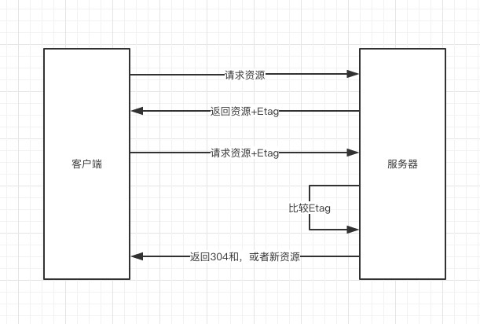

# 网络相关
> net
* [DNS预解析](#DNS预解析)
* [缓存](#缓存)
  * [1.强制缓存（强缓存）](#1.强制缓存（强缓存）)
  * [2.协商缓存（弱缓存）](#2.协商缓存（弱缓存）)
  * [浏览器行为引起的不同](#浏览器行为引起的不同)
  * [选择合适的缓存策略](#选择合适的缓存策略)
  * [静态资源缓存](#静态资源缓存)
* [使用HTTP/2.0](#使用HTTP/2.0)
* [](#)

## DNS预解析
DNS 解析也是需要时间的，可以通过预解析的方式来预先获得域名所对应的 IP。

DNS Prefetching 是让具有此属性的域名不需要用户点击链接就在后台解析，而域名解析和内容载入是串行的网络操作，所以这个方式能减少用户的等待时间，提升用户体验 。
```
<link rel="dns-prefetch" href="//yuchengkai.cn">
```

## 缓存
### 1.强制缓存（强缓存）


1. **Expires**：HTTP1.0使用的是 Expires 字段，该字段表示缓存到期时间，即有效时间+当时服务器的时间，然后将这个时间设置在header中返回给服务器。缺点：由于是绝对时间，用户可能会将客户端本地的时间进行修改，而导致浏览器判断缓存失效，重新请求该资源，同时，还导致客户端与服务端的时间不一致，致使缓存失效。
2. **Cache-Control**：在HTTP/1.1中，增加了一个字段 Cache-Control，该字段表示资源缓存的最大有效时间，在该时间内，客户端不需要向服务器发送请求。这两者的区别就是前者是绝对时间，而后者是相对时间。

强缓存表示在缓存期间不需要请求，state code 为 200
```
// Expires 是 HTTP / 1.0 的产物
// 表示资源会在 Wed, 22 Oct 2018 08:41:00 GMT 后过期
// 需要再次请求
Expires: Wed, 22 Oct 2018 08:41:00 GMT

// Cache-Control 出现于 HTTP / 1.1
// 优先级高于 Expires 
// 该属性表示资源会在 30 秒后过期，需要再次请求
Cache-control: max-age=30
```

### 2.协商缓存（弱缓存）


协商缓存主要应用于一些时常需要动态更新的资源文件。

1. **Last-Modified**：服务器告知客户端，资源最后一次被修改的时间。**If-Modified-Since**：再次请求时，请求头中带有该字段，服务器会将 If-Modified-Since 的值与 Last-Modified 字段进行对比，如果相等，则表示未修改，响应 304；反之，则表示修改了，响应 200 状态码，返回数据。

缺点：

* 如果资源更新的速度是秒以下单位，那么该缓存是不能被使用的，因为它的时间单位最低是秒。

* 如果文件是通过服务器动态生成的，那么该方法的更新时间永远是生成的时间，尽管文件可能没有变化，所以起不到缓存的作用。

2. **Etag**：Etag 存储的是文件的特殊标识(一般都是hash生成的)，服务器存储着文件的 Etag 字段，可以在与每次客户端传送 **If-None-Match** 的字段进行比较，如果相等，则表示未修改，响应 304；反之，则表示已修改，响应 200 状态码，返回数据。



ETag 优先级比 Last-Modified 高
### 浏览器行为引起的不同
1. 刷新网页 => 如果缓存没有失效，浏览器会直接使用缓存；反之，则向服务器请求数据
2. 手动刷新（F5） => 浏览器会认为缓存失效，在请求服务器时加上Cache-Control: max-age=0字段，然后询问服务器数据是否更新。
3. 强制刷新（Ctrl + F5） => 浏览器会直接忽略缓存，在请求服务器时加上Cache-Control: no-cache字段，然后重新向服务器拉取文件。

### 选择合适的缓存策略
* 对于某些不需要缓存的资源，可以使用 Cache-control: no-store ，表示该资源不需要缓存
* 对于频繁变动的资源，可以使用 Cache-Control: no-cache 并配合 ETag 使用，表示该资源已被缓存，但是每次都会发送请求询问资源是否更新。
* 对于代码文件来说，通常使用 Cache-Control: max-age=31536000 并配合策略缓存使用，然后对文件进行指纹处理，一旦文件名变动就会立刻下载新的文件。

### 静态资源缓存
由上面的缓存可知缓存分为：

* 协商缓存304
* 强制缓存
> 如何更新缓存？

* 通过更新页面中引用的资源路径，让浏览器主动放弃缓存，加载新资源。


* 页面引用了3个css，而某次上线只改了其中的a.css，如果所有链接都更新版本，就会导致b.css，c.css的缓存也失效，浪费了


* 利用数据摘要算法对文件求摘要信息，摘要信息与文件内容一一对应，就有了一种可以精确到单个文件粒度的缓存控制依据了


* 现代互联网企业，为了进一步提升网站性能，会把静态资源和动态网页分集群部署，静态资源会被部署到CDN节点上，网页中引用的资源也会变成对应的部署路径：


这次发布，同时改了页面结构和样式，也更新了静态资源对应的url地址，现在要发布代码上线，是先上线页面，还是先上线静态资源？


1. 先部署页面，再部署资源：在二者部署的时间间隔内，如果有用户访问页面，就会在新的页面结构中加载旧的资源，并且把这个旧版本的资源当做新版本缓存起来，其结果就是：用户访问到了一个样式错乱的页面，除非手动刷新，否则在资源缓存过期之前，页面会一直执行错误。

2. 先部署资源，再部署页面：在部署时间间隔之内，有旧版本资源本地缓存的用户访问网站，由于请求的页面是旧版本的，资源引用没有改变，浏览器将直接使用本地缓存，这种情况下页面展现正常；但没有本地缓存或者缓存过期的用户访问网站，就会出现旧版本页面加载新版本资源的情况，导致页面执行错误，但当页面完成部署，这部分用户再次访问页面又会恢复正常了。

* 资源的 **覆盖式发布**，用 **待发布资源** 覆盖 **已发布资源**，就有这种问题。解决它也好办，就是实现 **非覆盖式发布**。


> 应用场景：使用webpack打包之后，静态资源大部分场景下都有304缓存，更新上线之后希望用户能及时地看到内容，所以打包后的css和js名称加了20位hash值，文件名就唯一，只要不对html文件设置缓存，上线之后就可以加载最新的静态资源

## 使用HTTP/2.0
因为浏览器会有并发请求限制，在 HTTP / 1.1 时代，每个请求都需要建立和断开，消耗了好几个 RTT 时间，并且由于 TCP 慢启动的原因，加载体积大的文件会需要更多的时间。

在 HTTP / 2.0 中引入了**多路复用**，能够让多个请求使用同一个 TCP 链接，极大的加快了网页的加载速度。并且还支持 Header 压缩，进一步的减少了请求的数据大小。

## 预加载
预加载其实是声明式的 fetch ，强制浏览器请求资源，并且不会阻塞 onload 事件，可以使用以下代码开启预加载
```
<link rel="preload" href="http://example.com">
```
预加载可以一定程度上降低首屏的加载时间，因为可以将一些不影响首屏但重要的文件延后加载，唯一缺点就是兼容性不好。

## 预渲染
可以通过预渲染将下载的文件预先在后台渲染，可以使用以下代码开启预渲染
```
<link rel="prerender" href="http://example.com"> 
```
预渲染虽然可以提高页面的加载速度，但是要确保该页面百分百会被用户在之后打开，否则就白白浪费资源去渲染


