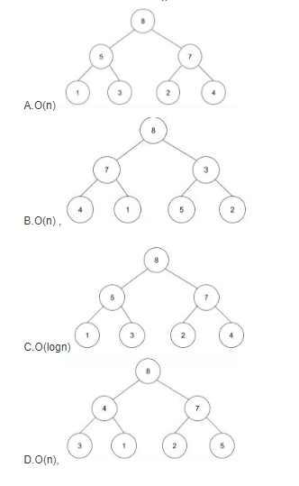

# 今日头条2017秋招前端工程师笔试试卷
[今日头条2017秋招前端工程师笔试试卷](https://www.nowcoder.com/test/question/analytic?tid=17420016)

## 1
```
变量a是一个64位有符号的整数，初始值用16进制表示为：0Xf000000000000000； 
变量b是一个64位有符号的整数，初始值用16进制表示为：0x7FFFFFFFFFFFFFFF。 
则a-b的结果用10进制表示为多少？（）

1
-(2^62+2^61+2^60+1)
2^62+2^61+2^60+1
2^59+(2^55+2^54+…+2^2+2^1+2^0)
```
答案：C
关键词：有符号位、初始值
0Xf000000000000000补码为1111000000000000000000000000000000000000000000000000000000000000

0x7FFFFFFFFFFFFFFF补码为0111111111111111111111111111111111111111111111111111111111111111

a-b=a+(-b)=
1111000000000000000000000000000000000000000000000000000000000000+
1000000000000000000000000000000000000000000000000000000000000001=
10111000000000000000000000000000000000000000000000000000000000001(高位溢出舍去)

则结果为
0111000000000000000000000000000000000000000000000000000000000001=2^62+2^61+2^60+1

## 2
```
console.log(([])?true:false); 
console.log(([]==false?true:false)); 
console.log(({}==false)?true:false) 
得到的结果分别是什么？（）
false true true
true true true
true false true
true true false
```
答案：D
Boolean([]); //true
Number([]); //0
Number({}); // NaN
Number(false); //0

console.log(([])?true:fasle);// => console.log((true)?true:false);
console.log([]==false?true:false); // => console.log(0==0?true:false);
console.log(({}==false)?true:false); // => console.log((NaN==0)?true:false);

## 3
```
下列哪些是块级元素（）
input
ul
hr
li
div
form
```
答案：BCDEF

块级元素：div hr h1-h6 ul ol li form p pre blokequote menu table fieldset address

行内元素（常考的）：a span input label img font等

## 4
```
关于跨域问题下面说法正确的是？（）
可以利用flash的http请求，来处理跨域问题
通过iframe设置document.domain可以实现跨域
一般情况下，m.toutiao.com可以ajax请求www.toutiao.com域名下的接口并获得响应
通过jsonp方式可以发出post请求其他域名下的接口
```
B
[几种跨域方式总结](https://blog.csdn.net/as645788/article/details/51285688)

## 5
```
以下符合 ES6 写法的有：（）
class Foo
{
	constructor() {return Object.create(null);}
}
Foo()

var m=1;
export m;

export var firstName=’Michael’;

在A模块中export{readFile}后，在B模块中import readFile from ‘A’可以获取到readFile
```
C

A、Fun() 把 class 当成方法来用？ var fun = new Func() 这样用就对了

B、export 后面变量没加括号；

D、import readFile 没加括号，是导入 default 的用法，但是前面不是 export 为 default


参照 export 和 import 用法：
1. [export](https://developer.mozilla.org/zh-CN/docs/Web/JavaScript/Reference/Statements/export)
2. [import](https://developer.mozilla.org/en-US/docs/Web/JavaScript/Reference/Statements/import)

## 6
```
可继承的样式属性包括（）
color
background-color
font-size
border
margin
```
AC

[CSS中可以和不可以继承的属性](http://www.cnblogs.com/thislbq/p/5882105.html)

## 7
```
堆的数据结构能够使得堆顶总是维持最大（对于大根堆）或最小（对于小根堆），给定一个数组，对这个数组进行建堆，则平均复杂度是多少？如果只是用堆的 push 操作，则一个大根堆依次输入 3,7,2,4,1,5,8 后，得到的堆的结构示意图是下述图表中的哪个？（）
```



[图解排序算法(三)之堆排序](https://www.cnblogs.com/chengxiao/p/6129630.html)
## 8
```
http 请求方式 get 和 post 的区别包括（）

get和post的可传输内容大小不一样，一个有限制一个没有限制
get和post传输的内容存放的位置不一样，一个放在header，一个放在body
get请求Content-type只能是text/html
get请求可以跨域、post请求不能跨域
```
AB

## 9
```
下面哪些属于JavaScript的typeof运算符的可能结果：（）

symbol
NaN
boolean
null
array
undefined
string
```
typeof Symbol()    //"symbol"
typeof Number()    //"number"
typeof String()    //"string"
typeof Function()    //"function"
typeof Object()    //"object"
typeof Boolean()    //"boolean"
typeof null    //"object"
typeof undefined    //"undefined"

## 10
```
老王有两个孩子，已知至少有一个孩子是在星期二出生的男孩。问：两个孩子都是男孩的概率是多大？

13/27
7/9
1/2
1/3
```
A

[https://blog.csdn.net/u012662688/article/details/52813387](https://blog.csdn.net/u012662688/article/details/52813387)

## 11
```
下列说法正确的有：（）

visibility:hidden;所占据的空间位置仍然存在，仅为视觉上的完全透明；
display:none;不为被隐藏的对象保留其物理空间；
visibility:hidden;与display:none;两者没有本质上的区别；
visibility:hidden;产生reflow和repaint（回流与重绘）；
```
AB

## 12
```
TCP断开连接的四次挥手中，第四次挥手发送的包会包含的标记，最正确的描述是？（）

FIN
FIN,PSH
ACK
FIN,ACK
```
c

[
TCP的三次握手与四次挥手（详解+动图）](https://blog.csdn.net/qzcsu/article/details/72861891)

## 13
```
查看解析
页面有一个按钮button id为button1，通过原生的js如何禁用？（）

document.getElementById(“button1”).setAttribute(“Readolny”,true);
document.getElementById(“button1”).setAttribute(“disabled”,”true”);
document.getElementById(“button1”).Readolny=true;
document.getElementById(“button1”).disabled=true;
```
BD

## 14
```
关于下列CSS选择器：ID选择器、类选择器、伪类选择器、标签名称选择器，排序正确的是：（）
ID选择器>Class选择器>伪类=标签名称选择器
ID选择器>伪类>Class选择器>标签名称选择器
ID选择器>Class选择器>伪类>标签名称选择器
ID选择器>Class选择器=伪类>标签名称选择器
```
D

## 15
```
假设 a 是一个由线程 1 和线程 2 共享的初始值为 0 的全局变量，则线程 1 和线程 2 同时执行下面的代码，最终 a 的结果不可能是（）


boolean isOdd = false;

for(int i=1;i<=2;++i)
{
  if（i%2==1）isOdd = true；
  else isOdd = false；
  a+=i*(isOdd?1:-1)；
}

-1
-2
0
1
```
D

假设两线程为A、B，设有3种情况：
1. AB不并发：此时相当于两个方法顺序执行。A执行完后a=-1，B使用-1作为a的初值，B执行完后a=-2
2. AB完全并发：此时读写冲突，相当于只有一个线程对a的读写最终生效。相同于方法只执行了一次。此时a=-1
3. AB部分并发：假设A先进行第一次读写，得到a=1;之后A的读写被B覆盖了。B使用用1作为a的初值，B执行完后a=0

## 16 
```
使用HTML+CSS实现如图布局，border-width:5px，格子大小是50px*50px，hover时边框变成红色，需要考虑语义化。
```


```
<!DOCTYPE html>
<html lang="en">
<head>
<meta charset="UTF-8">
<meta name="viewport" content="width=device-width, initial-scale=1.0">
<meta http-equiv="X-UA-Compatible" content="ie=edge">
<link href="https://cdn.bootcss.com/dragula/3.7.2/dragula.min.css" rel="stylesheet">
<link href="https://cdn.bootcss.com/font-awesome/4.7.0/css/font-awesome.min.css" rel="stylesheet">
<title>Document</title>
<style>
*{
margin: 40px;
padding: 0px;
}
#container{
width:170px;

}
.btn{
position: relative;
width: 50px;
height: 50px;
border:5px solid blue;
transition: all 0.7s;
margin:-2.5px -5px;
}

.btn:hover{
border-color:chocolate;
z-index:10;
}


</style>
</head>
<body>
<div id='container'>
<button class='btn'>1</button>
<button class='btn'>2</button>
<button class='btn'>3</button>
<button class='btn'>4</button>
<button class='btn'>5</button>
<button class='btn'>6</button>
<button class='btn'>7</button>
<button class='btn'>8</button>
<button class='btn'>9</button>
</div>
</script>
</body>
</html>
```

## 17
```
给出一个上传文件时不用刷新页面的方案，要求写出关键部分的js代码。
```
```
<input id="upload" type="file"/>
<button id="upload-btn">upload</button>
document.getElementById('upload-btn').onclick = function(){ 
 var oInput = document.getElementById('upload'); 
 var file = oInput.files[0];  //选取文件
 var formData = new FormData(); //创建表单数据对象
 formData.append('file',file); //将文件添加到表单对象中
 fetch({       //传输
  url:'./',
  mothod:'POST',
  body:formData 
 }) 
 .then((d)=>{
 console.log('result is',d);
 alert("上传完毕！")
 })
}
```